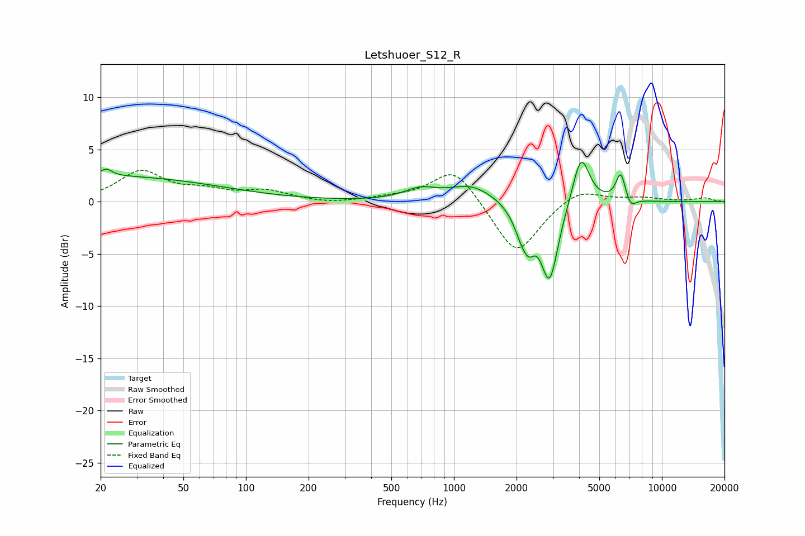

# Letshuoer_S12_R
See [usage instructions](https://github.com/jaakkopasanen/AutoEq#usage) for more options and info.

### Parametric EQs
Apply preamp of -3.9 dB when using parametric equalizer.

|   # | Type    |   Fc (Hz) |    Q |   Gain (dB) |
|-----|---------|-----------|------|-------------|
|   1 | Peaking |        20 | 0.24 |         2.4 |
|   2 | Peaking |        21 | 5.4  |         0.7 |
|   3 | Peaking |       689 | 1.81 |         1   |
|   4 | Peaking |      1213 | 1.31 |         1.5 |
|   5 | Peaking |      2155 | 3.41 |        -3   |
|   6 | Peaking |      2316 | 6    |        -1.2 |
|   7 | Peaking |      2882 | 3.32 |        -7.5 |
|   8 | Peaking |      4083 | 3.46 |         4.9 |
|   9 | Peaking |      6338 | 6    |         2.7 |
|  10 | Peaking |      7091 | 5.93 |        -0.9 |

### Fixed Band EQs
When using fixed band (also called graphic) equalizer, apply preamp of **-3.1 dB** (if available) and set gains manually with these parameters.

|   # | Type    |   Fc (Hz) |    Q |   Gain (dB) |
|-----|---------|-----------|------|-------------|
|   1 | Peaking |        31 | 1.41 |         2.8 |
|   2 | Peaking |        62 | 1.41 |         0.9 |
|   3 | Peaking |       125 | 1.41 |         1   |
|   4 | Peaking |       250 | 1.41 |        -0.2 |
|   5 | Peaking |       500 | 1.41 |         0.3 |
|   6 | Peaking |      1000 | 1.41 |         3.4 |
|   7 | Peaking |      2000 | 1.41 |        -5.3 |
|   8 | Peaking |      4000 | 1.41 |         1.4 |
|   9 | Peaking |      8000 | 1.41 |         0.4 |
|  10 | Peaking |     16000 | 1.41 |         0.3 |

### Graphs

