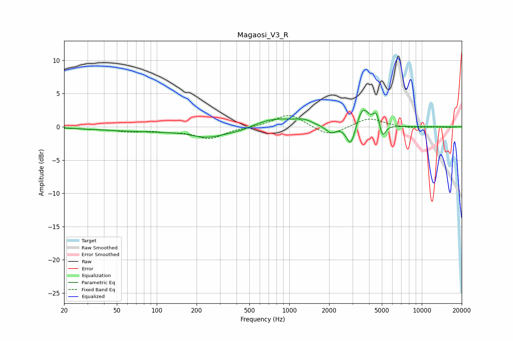

# Magaosi_V3_R
See [usage instructions](https://github.com/jaakkopasanen/AutoEq#usage) for more options and info.

### Parametric EQs
Apply preamp of -2.6 dB when using parametric equalizer.

|   # | Type    |   Fc (Hz) |    Q |   Gain (dB) |
|-----|---------|-----------|------|-------------|
|   1 | Peaking |        83 | 0.38 |        -0.6 |
|   2 | Peaking |       245 | 1.14 |        -1.3 |
|   3 | Peaking |       412 | 1.43 |        -0.5 |
|   4 | Peaking |       791 | 0.92 |         1.3 |
|   5 | Peaking |      1289 | 2.42 |         0.6 |
|   6 | Peaking |      2052 | 3.63 |        -1.1 |
|   7 | Peaking |      2914 | 4.32 |        -3.3 |
|   8 | Peaking |      3589 | 3.15 |         3   |
|   9 | Peaking |      4537 | 6    |         2   |
|  10 | Peaking |      5056 | 6    |        -2.1 |

### Fixed Band EQs
When using fixed band (also called graphic) equalizer, apply preamp of **-1.8 dB** (if available) and set gains manually with these parameters.

|   # | Type    |   Fc (Hz) |    Q |   Gain (dB) |
|-----|---------|-----------|------|-------------|
|   1 | Peaking |        31 | 1.41 |        -0.3 |
|   2 | Peaking |        62 | 1.41 |        -0.6 |
|   3 | Peaking |       125 | 1.41 |        -0.5 |
|   4 | Peaking |       250 | 1.41 |        -1.7 |
|   5 | Peaking |       500 | 1.41 |        -0.1 |
|   6 | Peaking |      1000 | 1.41 |         2   |
|   7 | Peaking |      2000 | 1.41 |        -1.5 |
|   8 | Peaking |      4000 | 1.41 |         1.4 |
|   9 | Peaking |      8000 | 1.41 |        -0.2 |
|  10 | Peaking |     16000 | 1.41 |        -0.1 |

### Graphs

