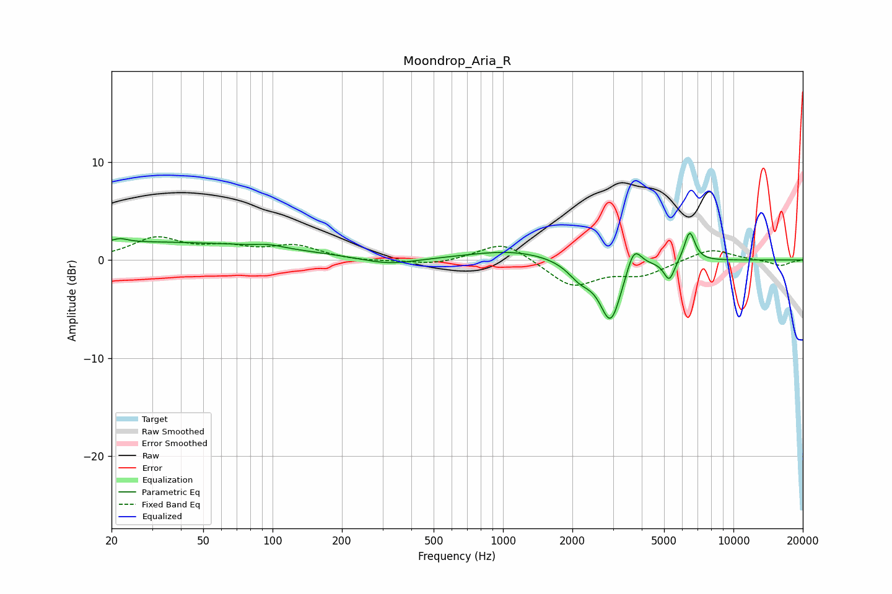

# Moondrop_Aria_R
See [usage instructions](https://github.com/jaakkopasanen/AutoEq#usage) for more options and info.

### Parametric EQs
Apply preamp of -2.8 dB when using parametric equalizer.

|   # | Type    |   Fc (Hz) |    Q |   Gain (dB) |
|-----|---------|-----------|------|-------------|
|   1 | Peaking |        22 | 4.54 |         0.4 |
|   2 | Peaking |        27 | 0.18 |         1.8 |
|   3 | Peaking |        97 | 2.64 |         0.3 |
|   4 | Peaking |       318 | 1.18 |        -0.7 |
|   5 | Peaking |      1095 | 0.75 |         1   |
|   6 | Peaking |      2167 | 2.58 |        -1.6 |
|   7 | Peaking |      2934 | 3    |        -6.2 |
|   8 | Peaking |      3698 | 4.36 |         2.6 |
|   9 | Peaking |      5267 | 6    |        -2.1 |
|  10 | Peaking |      6459 | 5.96 |         3.1 |

### Fixed Band EQs
When using fixed band (also called graphic) equalizer, apply preamp of **-2.5 dB** (if available) and set gains manually with these parameters.

|   # | Type    |   Fc (Hz) |    Q |   Gain (dB) |
|-----|---------|-----------|------|-------------|
|   1 | Peaking |        31 | 1.41 |         2.1 |
|   2 | Peaking |        62 | 1.41 |         1.1 |
|   3 | Peaking |       125 | 1.41 |         1.3 |
|   4 | Peaking |       250 | 1.41 |        -0.2 |
|   5 | Peaking |       500 | 1.41 |        -0.5 |
|   6 | Peaking |      1000 | 1.41 |         2   |
|   7 | Peaking |      2000 | 1.41 |        -2.7 |
|   8 | Peaking |      4000 | 1.41 |        -1.4 |
|   9 | Peaking |      8000 | 1.41 |         1.2 |
|  10 | Peaking |     16000 | 1.41 |        -0.6 |

### Graphs

