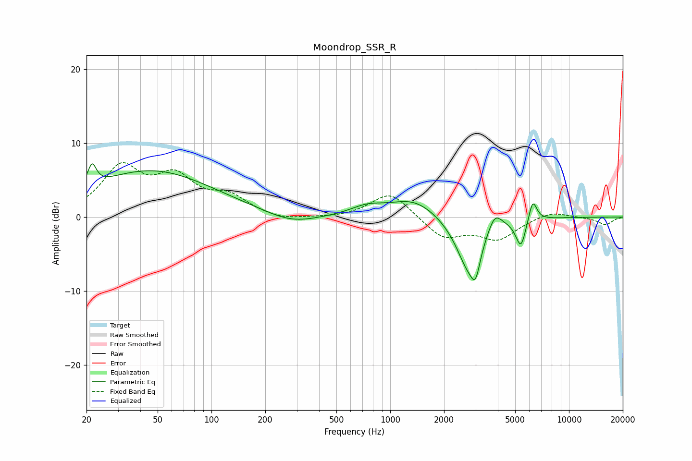

# Moondrop_SSR_R
See [usage instructions](https://github.com/jaakkopasanen/AutoEq#usage) for more options and info.

### Parametric EQs
Apply preamp of -7.3 dB when using parametric equalizer.

|   # | Type    |   Fc (Hz) |    Q |   Gain (dB) |
|-----|---------|-----------|------|-------------|
|   1 | Peaking |        21 | 5.97 |         2.9 |
|   2 | Peaking |        46 | 0.4  |         6.3 |
|   3 | Peaking |       281 | 0.99 |        -1.4 |
|   4 | Peaking |       743 | 1.52 |         1.1 |
|   5 | Peaking |      1357 | 1.05 |         2.5 |
|   6 | Peaking |      2758 | 1.93 |        -7.2 |
|   7 | Peaking |      3003 | 5.96 |        -3   |
|   8 | Peaking |      3842 | 3.57 |         2.5 |
|   9 | Peaking |      5383 | 4.92 |        -3.8 |
|  10 | Peaking |      6268 | 5.92 |         3   |

### Fixed Band EQs
When using fixed band (also called graphic) equalizer, apply preamp of **-7.5 dB** (if available) and set gains manually with these parameters.

|   # | Type    |   Fc (Hz) |    Q |   Gain (dB) |
|-----|---------|-----------|------|-------------|
|   1 | Peaking |        31 | 1.41 |         6.4 |
|   2 | Peaking |        62 | 1.41 |         4.7 |
|   3 | Peaking |       125 | 1.41 |         2.4 |
|   4 | Peaking |       250 | 1.41 |        -0.6 |
|   5 | Peaking |       500 | 1.41 |        -0.2 |
|   6 | Peaking |      1000 | 1.41 |         3.5 |
|   7 | Peaking |      2000 | 1.41 |        -2.8 |
|   8 | Peaking |      4000 | 1.41 |        -2.9 |
|   9 | Peaking |      8000 | 1.41 |         0.9 |
|  10 | Peaking |     16000 | 1.41 |        -1   |

### Graphs

