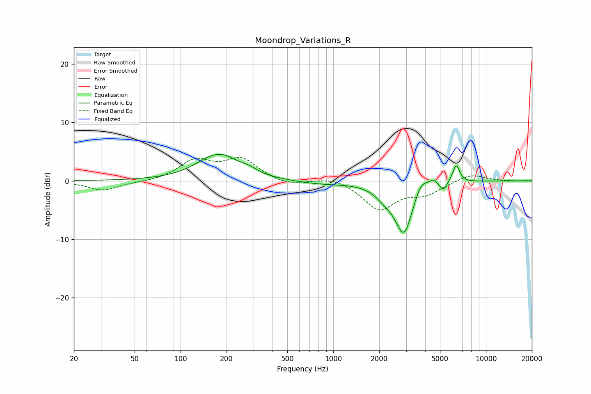

# Moondrop_Variations_R
See [usage instructions](https://github.com/jaakkopasanen/AutoEq#usage) for more options and info.

### Parametric EQs
Apply preamp of -4.6 dB when using parametric equalizer.

|   # | Type    |   Fc (Hz) |    Q |   Gain (dB) |
|-----|---------|-----------|------|-------------|
|   1 | Peaking |       168 | 3.06 |        -0.2 |
|   2 | Peaking |       176 | 1.09 |         4.7 |
|   3 | Peaking |       282 | 2.8  |         0.6 |
|   4 | Peaking |       822 | 0.79 |        -0.5 |
|   5 | Peaking |      2173 | 2.33 |        -1.4 |
|   6 | Peaking |      2909 | 2.35 |        -9   |
|   7 | Peaking |      3759 | 2.97 |         2.5 |
|   8 | Peaking |      4540 | 6    |         0.9 |
|   9 | Peaking |      5258 | 6    |        -1.4 |
|  10 | Peaking |      6378 | 5.99 |         3.1 |

### Fixed Band EQs
When using fixed band (also called graphic) equalizer, apply preamp of **-4.1 dB** (if available) and set gains manually with these parameters.

|   # | Type    |   Fc (Hz) |    Q |   Gain (dB) |
|-----|---------|-----------|------|-------------|
|   1 | Peaking |        31 | 1.41 |        -1.7 |
|   2 | Peaking |        62 | 1.41 |        -0.2 |
|   3 | Peaking |       125 | 1.41 |         3.3 |
|   4 | Peaking |       250 | 1.41 |         3.6 |
|   5 | Peaking |       500 | 1.41 |        -0.9 |
|   6 | Peaking |      1000 | 1.41 |         0.8 |
|   7 | Peaking |      2000 | 1.41 |        -4.8 |
|   8 | Peaking |      4000 | 1.41 |        -2   |
|   9 | Peaking |      8000 | 1.41 |         1.2 |
|  10 | Peaking |     16000 | 1.41 |        -0   |

### Graphs

