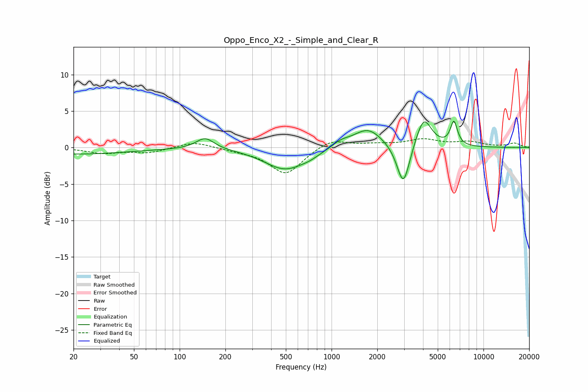

# Oppo_Enco_X2_-_Simple_and_Clear_R
See [usage instructions](https://github.com/jaakkopasanen/AutoEq#usage) for more options and info.

### Parametric EQs
Apply preamp of -3.7 dB when using parametric equalizer.

|   # | Type    |   Fc (Hz) |    Q |   Gain (dB) |
|-----|---------|-----------|------|-------------|
|   1 | Peaking |        20 | 0.38 |        -0.9 |
|   2 | Peaking |       146 | 3.08 |        -0.1 |
|   3 | Peaking |       147 | 2.41 |         1.7 |
|   4 | Peaking |       496 | 1.03 |        -3   |
|   5 | Peaking |       724 | 2.4  |        -0.3 |
|   6 | Peaking |      1148 | 2.35 |         0.8 |
|   7 | Peaking |      1736 | 1.46 |         2.7 |
|   8 | Peaking |      2969 | 3.33 |        -5.9 |
|   9 | Peaking |      4041 | 2.74 |         4.2 |
|  10 | Peaking |      6387 | 5.94 |         3.2 |

### Fixed Band EQs
When using fixed band (also called graphic) equalizer, apply preamp of **-1.3 dB** (if available) and set gains manually with these parameters.

|   # | Type    |   Fc (Hz) |    Q |   Gain (dB) |
|-----|---------|-----------|------|-------------|
|   1 | Peaking |        31 | 1.41 |        -0.7 |
|   2 | Peaking |        62 | 1.41 |        -0.7 |
|   3 | Peaking |       125 | 1.41 |         0.9 |
|   4 | Peaking |       250 | 1.41 |        -0.3 |
|   5 | Peaking |       500 | 1.41 |        -3.7 |
|   6 | Peaking |      1000 | 1.41 |         1.3 |
|   7 | Peaking |      2000 | 1.41 |         0.4 |
|   8 | Peaking |      4000 | 1.41 |         1   |
|   9 | Peaking |      8000 | 1.41 |         0.7 |
|  10 | Peaking |     16000 | 1.41 |         0.6 |

### Graphs

