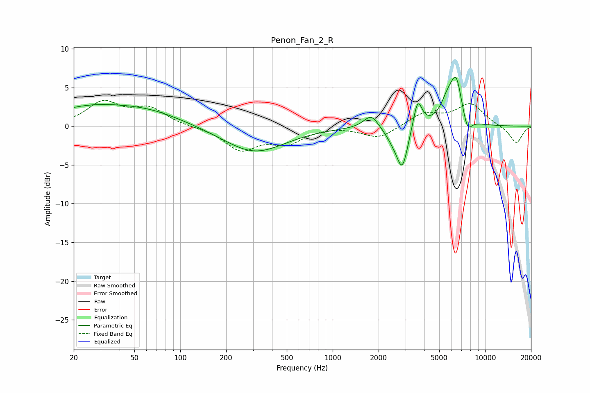

# Penon_Fan_2_R
See [usage instructions](https://github.com/jaakkopasanen/AutoEq#usage) for more options and info.

### Parametric EQs
Apply preamp of -6.4 dB when using parametric equalizer.

|   # | Type    |   Fc (Hz) |    Q |   Gain (dB) |
|-----|---------|-----------|------|-------------|
|   1 | Peaking |        25 | 0.55 |         2.2 |
|   2 | Peaking |        63 | 0.6  |         1.6 |
|   3 | Peaking |       306 | 0.7  |        -3.4 |
|   4 | Peaking |      1791 | 2.93 |         1.8 |
|   5 | Peaking |      2485 | 2.73 |        -1.2 |
|   6 | Peaking |      2865 | 3.75 |        -5.2 |
|   7 | Peaking |      3611 | 4.87 |         3.8 |
|   8 | Peaking |      5693 | 2.87 |         2.8 |
|   9 | Peaking |      6475 | 3.69 |         5.1 |
|  10 | Peaking |      7652 | 4.59 |        -2   |

### Fixed Band EQs
When using fixed band (also called graphic) equalizer, apply preamp of **-3.4 dB** (if available) and set gains manually with these parameters.

|   # | Type    |   Fc (Hz) |    Q |   Gain (dB) |
|-----|---------|-----------|------|-------------|
|   1 | Peaking |        31 | 1.41 |         3   |
|   2 | Peaking |        62 | 1.41 |         2.2 |
|   3 | Peaking |       125 | 1.41 |        -0.1 |
|   4 | Peaking |       250 | 1.41 |        -2.9 |
|   5 | Peaking |       500 | 1.41 |        -2   |
|   6 | Peaking |      1000 | 1.41 |         0.1 |
|   7 | Peaking |      2000 | 1.41 |        -1.6 |
|   8 | Peaking |      4000 | 1.41 |         1.6 |
|   9 | Peaking |      8000 | 1.41 |         2.8 |
|  10 | Peaking |     16000 | 1.41 |        -2.2 |

### Graphs

