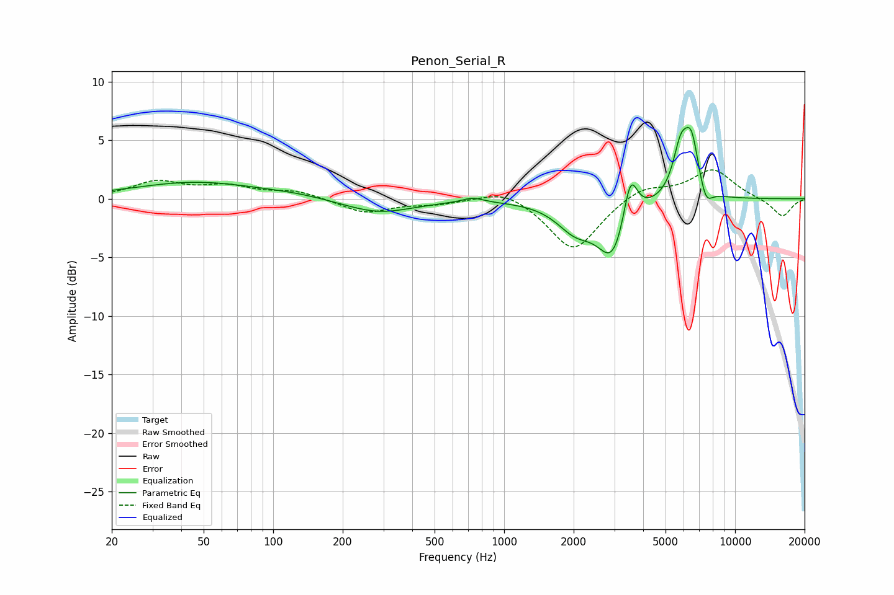

# Penon_Serial_R
See [usage instructions](https://github.com/jaakkopasanen/AutoEq#usage) for more options and info.

### Parametric EQs
Apply preamp of -6.2 dB when using parametric equalizer.

|   # | Type    |   Fc (Hz) |    Q |   Gain (dB) |
|-----|---------|-----------|------|-------------|
|   1 | Peaking |        46 | 0.52 |         1.4 |
|   2 | Peaking |       125 | 1.06 |         0.2 |
|   3 | Peaking |       286 | 0.93 |        -1.2 |
|   4 | Peaking |       732 | 3.1  |         0.4 |
|   5 | Peaking |      2037 | 1.73 |        -2.3 |
|   6 | Peaking |      2962 | 2.19 |        -4.8 |
|   7 | Peaking |      3521 | 4.6  |         4.1 |
|   8 | Peaking |      5819 | 4.07 |         3.9 |
|   9 | Peaking |      6481 | 4.32 |         4.5 |
|  10 | Peaking |      7471 | 4.99 |        -1.5 |

### Fixed Band EQs
When using fixed band (also called graphic) equalizer, apply preamp of **-2.6 dB** (if available) and set gains manually with these parameters.

|   # | Type    |   Fc (Hz) |    Q |   Gain (dB) |
|-----|---------|-----------|------|-------------|
|   1 | Peaking |        31 | 1.41 |         1.4 |
|   2 | Peaking |        62 | 1.41 |         1   |
|   3 | Peaking |       125 | 1.41 |         0.6 |
|   4 | Peaking |       250 | 1.41 |        -1.2 |
|   5 | Peaking |       500 | 1.41 |        -0.4 |
|   6 | Peaking |      1000 | 1.41 |         1   |
|   7 | Peaking |      2000 | 1.41 |        -4.5 |
|   8 | Peaking |      4000 | 1.41 |         1.1 |
|   9 | Peaking |      8000 | 1.41 |         2.5 |
|  10 | Peaking |     16000 | 1.41 |        -1.6 |

### Graphs

