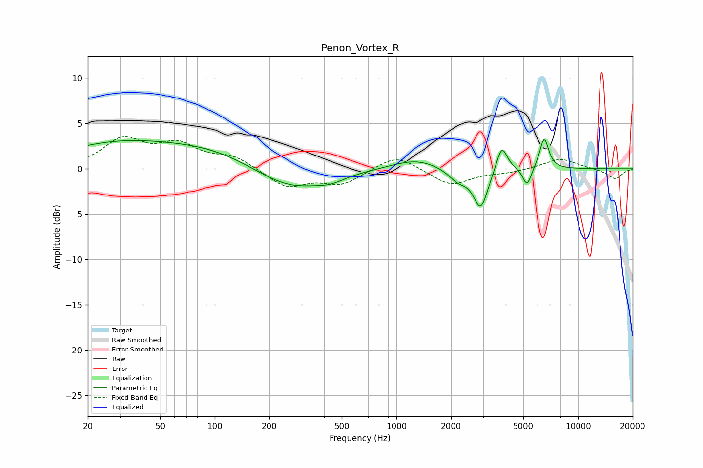

# Penon_Vortex_R
See [usage instructions](https://github.com/jaakkopasanen/AutoEq#usage) for more options and info.

### Parametric EQs
Apply preamp of -3.3 dB when using parametric equalizer.

|   # | Type    |   Fc (Hz) |    Q |   Gain (dB) |
|-----|---------|-----------|------|-------------|
|   1 | Peaking |        29 | 0.43 |         2.7 |
|   2 | Peaking |        97 | 0.56 |         1.6 |
|   3 | Peaking |       261 | 0.74 |        -2.4 |
|   4 | Peaking |       433 | 1.87 |        -0.6 |
|   5 | Peaking |      1274 | 1.08 |         1.1 |
|   6 | Peaking |      2180 | 2.68 |        -1.3 |
|   7 | Peaking |      2911 | 3.54 |        -4.3 |
|   8 | Peaking |      3802 | 4.65 |         2.9 |
|   9 | Peaking |      5242 | 6    |        -2.1 |
|  10 | Peaking |      6509 | 5.51 |         3.4 |

### Fixed Band EQs
When using fixed band (also called graphic) equalizer, apply preamp of **-3.7 dB** (if available) and set gains manually with these parameters.

|   # | Type    |   Fc (Hz) |    Q |   Gain (dB) |
|-----|---------|-----------|------|-------------|
|   1 | Peaking |        31 | 1.41 |         3.1 |
|   2 | Peaking |        62 | 1.41 |         2.4 |
|   3 | Peaking |       125 | 1.41 |         1.3 |
|   4 | Peaking |       250 | 1.41 |        -2   |
|   5 | Peaking |       500 | 1.41 |        -1.6 |
|   6 | Peaking |      1000 | 1.41 |         1.7 |
|   7 | Peaking |      2000 | 1.41 |        -1.8 |
|   8 | Peaking |      4000 | 1.41 |        -0.4 |
|   9 | Peaking |      8000 | 1.41 |         1.2 |
|  10 | Peaking |     16000 | 1.41 |        -1.1 |

### Graphs

