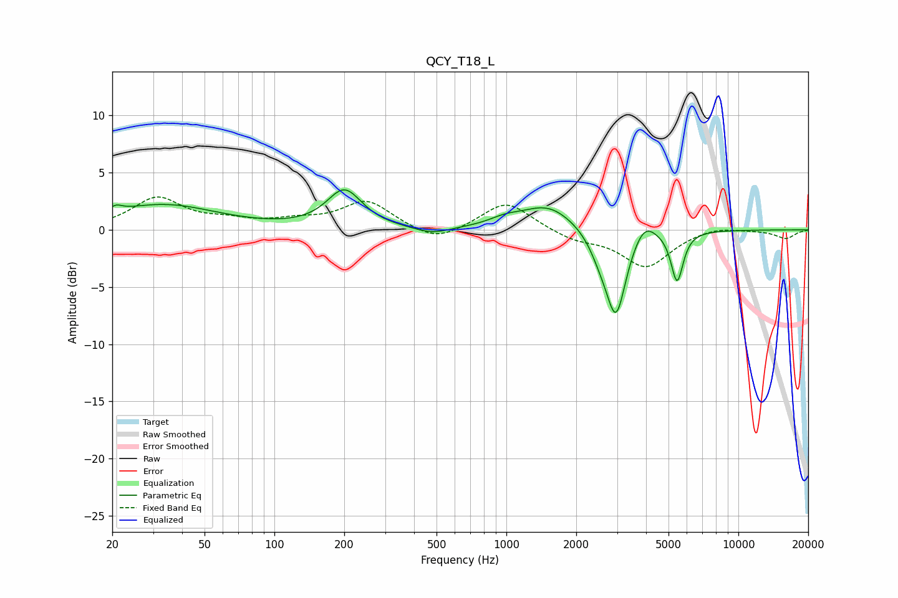

# QCY_T18_L
See [usage instructions](https://github.com/jaakkopasanen/AutoEq#usage) for more options and info.

### Parametric EQs
Apply preamp of -3.6 dB when using parametric equalizer.

|   # | Type    |   Fc (Hz) |    Q |   Gain (dB) |
|-----|---------|-----------|------|-------------|
|   1 | Peaking |        21 | 5.25 |         0.5 |
|   2 | Peaking |        33 | 0.61 |         2.2 |
|   3 | Peaking |       200 | 1.89 |         3.3 |
|   4 | Peaking |       479 | 1.87 |        -0.6 |
|   5 | Peaking |       985 | 2.09 |         0.5 |
|   6 | Peaking |      1513 | 1.23 |         2.2 |
|   7 | Peaking |      2534 | 3.07 |        -1.4 |
|   8 | Peaking |      2969 | 3.23 |        -7.4 |
|   9 | Peaking |      3928 | 2.96 |         1.6 |
|  10 | Peaking |      5443 | 5.38 |        -4.4 |

### Fixed Band EQs
When using fixed band (also called graphic) equalizer, apply preamp of **-3.0 dB** (if available) and set gains manually with these parameters.

|   # | Type    |   Fc (Hz) |    Q |   Gain (dB) |
|-----|---------|-----------|------|-------------|
|   1 | Peaking |        31 | 1.41 |         2.7 |
|   2 | Peaking |        62 | 1.41 |         0.6 |
|   3 | Peaking |       125 | 1.41 |         0.6 |
|   4 | Peaking |       250 | 1.41 |         2.5 |
|   5 | Peaking |       500 | 1.41 |        -1.2 |
|   6 | Peaking |      1000 | 1.41 |         2.5 |
|   7 | Peaking |      2000 | 1.41 |        -0.8 |
|   8 | Peaking |      4000 | 1.41 |        -3.2 |
|   9 | Peaking |      8000 | 1.41 |         0.4 |
|  10 | Peaking |     16000 | 1.41 |        -0.7 |

### Graphs

