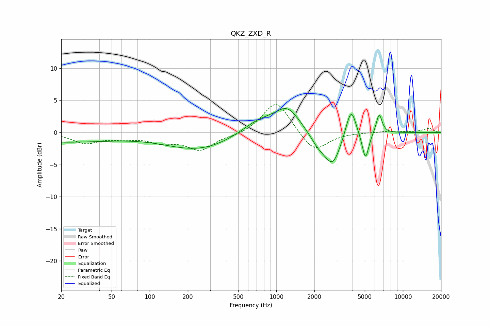

# QKZ_ZXD_R
See [usage instructions](https://github.com/jaakkopasanen/AutoEq#usage) for more options and info.

### Parametric EQs
Apply preamp of -3.8 dB when using parametric equalizer.

|   # | Type    |   Fc (Hz) |    Q |   Gain (dB) |
|-----|---------|-----------|------|-------------|
|   1 | Peaking |        20 | 0.32 |        -1.4 |
|   2 | Peaking |       247 | 0.52 |        -2.7 |
|   3 | Peaking |       739 | 0.97 |         2.2 |
|   4 | Peaking |      1230 | 1.49 |         3.5 |
|   5 | Peaking |      2139 | 2.24 |        -1.7 |
|   6 | Peaking |      2786 | 2.16 |        -4.9 |
|   7 | Peaking |      3855 | 3.48 |         4.1 |
|   8 | Peaking |      4028 | 5.65 |         0.7 |
|   9 | Peaking |      5064 | 5.24 |        -4.3 |
|  10 | Peaking |      6491 | 5.86 |         3.1 |

### Fixed Band EQs
When using fixed band (also called graphic) equalizer, apply preamp of **-4.4 dB** (if available) and set gains manually with these parameters.

|   # | Type    |   Fc (Hz) |    Q |   Gain (dB) |
|-----|---------|-----------|------|-------------|
|   1 | Peaking |        31 | 1.41 |        -1.6 |
|   2 | Peaking |        62 | 1.41 |        -0.7 |
|   3 | Peaking |       125 | 1.41 |        -1.3 |
|   4 | Peaking |       250 | 1.41 |        -2.6 |
|   5 | Peaking |       500 | 1.41 |        -0.5 |
|   6 | Peaking |      1000 | 1.41 |         5.1 |
|   7 | Peaking |      2000 | 1.41 |        -3.2 |
|   8 | Peaking |      4000 | 1.41 |         0   |
|   9 | Peaking |      8000 | 1.41 |         0.2 |
|  10 | Peaking |     16000 | 1.41 |         0.6 |

### Graphs

