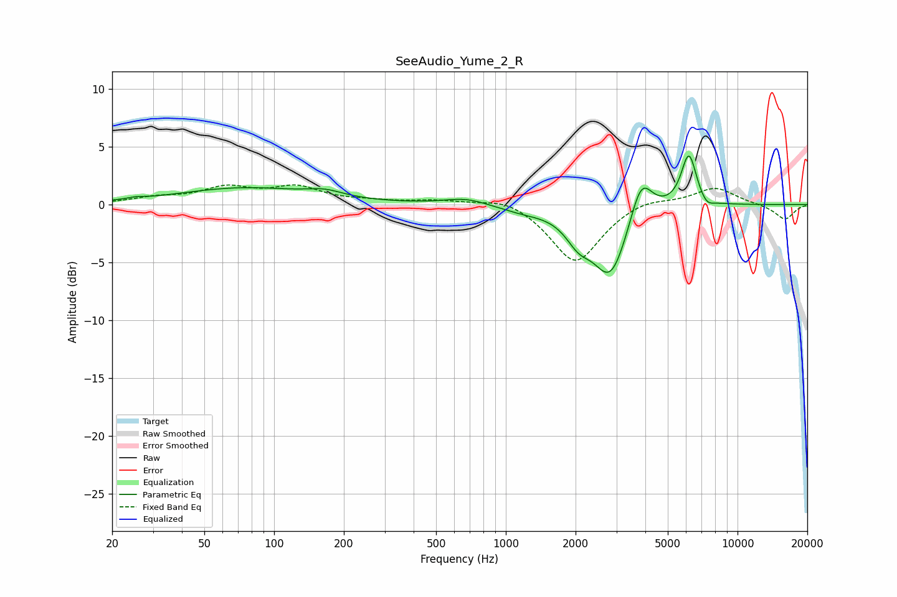

# SeeAudio_Yume_2_R
See [usage instructions](https://github.com/jaakkopasanen/AutoEq#usage) for more options and info.

### Parametric EQs
Apply preamp of -4.3 dB when using parametric equalizer.

|   # | Type    |   Fc (Hz) |    Q |   Gain (dB) |
|-----|---------|-----------|------|-------------|
|   1 | Peaking |        25 | 4.11 |         0.1 |
|   2 | Peaking |        74 | 0.5  |         1.4 |
|   3 | Peaking |       165 | 1.8  |         0.6 |
|   4 | Peaking |       676 | 1.49 |         0.6 |
|   5 | Peaking |      1189 | 1.29 |        -0.5 |
|   6 | Peaking |      2060 | 2.51 |        -1.9 |
|   7 | Peaking |      2833 | 1.86 |        -6.1 |
|   8 | Peaking |      3837 | 2.93 |         3.7 |
|   9 | Peaking |      6165 | 4.12 |         4.6 |
|  10 | Peaking |      7353 | 4.57 |        -0.7 |

### Fixed Band EQs
When using fixed band (also called graphic) equalizer, apply preamp of **-1.8 dB** (if available) and set gains manually with these parameters.

|   # | Type    |   Fc (Hz) |    Q |   Gain (dB) |
|-----|---------|-----------|------|-------------|
|   1 | Peaking |        31 | 1.41 |         0.5 |
|   2 | Peaking |        62 | 1.41 |         1.3 |
|   3 | Peaking |       125 | 1.41 |         1.4 |
|   4 | Peaking |       250 | 1.41 |         0.2 |
|   5 | Peaking |       500 | 1.41 |         0.3 |
|   6 | Peaking |      1000 | 1.41 |         0.7 |
|   7 | Peaking |      2000 | 1.41 |        -5.1 |
|   8 | Peaking |      4000 | 1.41 |         0.6 |
|   9 | Peaking |      8000 | 1.41 |         1.5 |
|  10 | Peaking |     16000 | 1.41 |        -1.3 |

### Graphs

