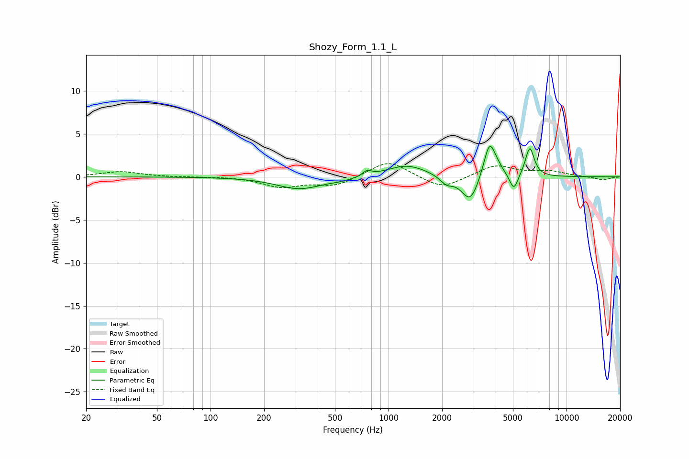

# Shozy_Form_1.1_L
See [usage instructions](https://github.com/jaakkopasanen/AutoEq#usage) for more options and info.

### Parametric EQs
Apply preamp of -3.7 dB when using parametric equalizer.

|   # | Type    |   Fc (Hz) |    Q |   Gain (dB) |
|-----|---------|-----------|------|-------------|
|   1 | Peaking |       316 | 1.11 |        -1.4 |
|   2 | Peaking |       547 | 2.17 |        -0.2 |
|   3 | Peaking |       758 | 6    |         0.6 |
|   4 | Peaking |      1270 | 1.25 |         1.4 |
|   5 | Peaking |      2117 | 3.94 |        -0.9 |
|   6 | Peaking |      2878 | 2.9  |        -3.1 |
|   7 | Peaking |      3698 | 4.22 |         4.3 |
|   8 | Peaking |      4156 | 5.35 |         0.4 |
|   9 | Peaking |      5060 | 6    |        -1.9 |
|  10 | Peaking |      6218 | 5.66 |         3.4 |

### Fixed Band EQs
When using fixed band (also called graphic) equalizer, apply preamp of **-1.6 dB** (if available) and set gains manually with these parameters.

|   # | Type    |   Fc (Hz) |    Q |   Gain (dB) |
|-----|---------|-----------|------|-------------|
|   1 | Peaking |        31 | 1.41 |         0.6 |
|   2 | Peaking |        62 | 1.41 |        -0   |
|   3 | Peaking |       125 | 1.41 |         0.1 |
|   4 | Peaking |       250 | 1.41 |        -1.1 |
|   5 | Peaking |       500 | 1.41 |        -1   |
|   6 | Peaking |      1000 | 1.41 |         2   |
|   7 | Peaking |      2000 | 1.41 |        -1.5 |
|   8 | Peaking |      4000 | 1.41 |         1.4 |
|   9 | Peaking |      8000 | 1.41 |         0.6 |
|  10 | Peaking |     16000 | 1.41 |        -0.4 |

### Graphs

