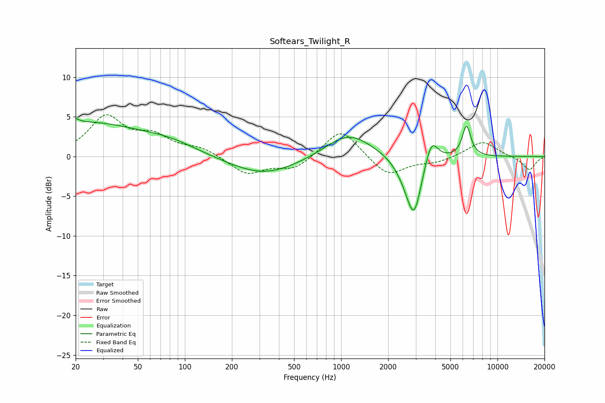

# Softears_Twilight_R
See [usage instructions](https://github.com/jaakkopasanen/AutoEq#usage) for more options and info.

### Parametric EQs
Apply preamp of -4.9 dB when using parametric equalizer.

|   # | Type    |   Fc (Hz) |    Q |   Gain (dB) |
|-----|---------|-----------|------|-------------|
|   1 | Peaking |        20 | 5.59 |         3.3 |
|   2 | Peaking |        20 | 5.87 |        -2.6 |
|   3 | Peaking |        24 | 0.41 |         4.1 |
|   4 | Peaking |        80 | 0.75 |         1.2 |
|   5 | Peaking |       320 | 0.63 |        -2.4 |
|   6 | Peaking |      1117 | 0.96 |         3.1 |
|   7 | Peaking |      2633 | 1.98 |        -1.7 |
|   8 | Peaking |      2931 | 2.98 |        -6.5 |
|   9 | Peaking |      3774 | 3.48 |         3.2 |
|  10 | Peaking |      6343 | 5    |         3.9 |

### Fixed Band EQs
When using fixed band (also called graphic) equalizer, apply preamp of **-5.4 dB** (if available) and set gains manually with these parameters.

|   # | Type    |   Fc (Hz) |    Q |   Gain (dB) |
|-----|---------|-----------|------|-------------|
|   1 | Peaking |        31 | 1.41 |         4.8 |
|   2 | Peaking |        62 | 1.41 |         2.2 |
|   3 | Peaking |       125 | 1.41 |         1   |
|   4 | Peaking |       250 | 1.41 |        -2.2 |
|   5 | Peaking |       500 | 1.41 |        -1.6 |
|   6 | Peaking |      1000 | 1.41 |         3.7 |
|   7 | Peaking |      2000 | 1.41 |        -2.5 |
|   8 | Peaking |      4000 | 1.41 |        -0.7 |
|   9 | Peaking |      8000 | 1.41 |         2   |
|  10 | Peaking |     16000 | 1.41 |        -1.7 |

### Graphs

