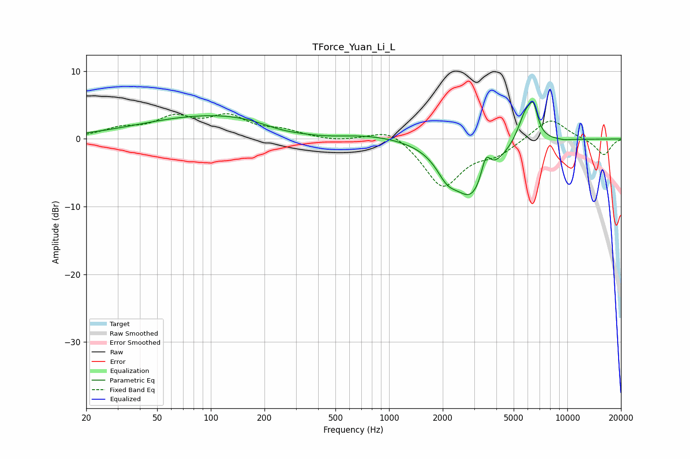

# TForce_Yuan_Li_L
See [usage instructions](https://github.com/jaakkopasanen/AutoEq#usage) for more options and info.

### Parametric EQs
Apply preamp of -5.6 dB when using parametric equalizer.

|   # | Type    |   Fc (Hz) |    Q |   Gain (dB) |
|-----|---------|-----------|------|-------------|
|   1 | Peaking |       168 | 0.23 |         4.1 |
|   2 | Peaking |       183 | 0.62 |         0.1 |
|   3 | Peaking |       247 | 0.97 |        -1.5 |
|   4 | Peaking |       427 | 0.76 |        -2.1 |
|   5 | Peaking |      2112 | 2.49 |        -2.6 |
|   6 | Peaking |      2924 | 1.31 |        -8.4 |
|   7 | Peaking |      3488 | 5.29 |         3.6 |
|   8 | Peaking |      5855 | 2.99 |         4.8 |
|   9 | Peaking |      6462 | 5.91 |         3.3 |
|  10 | Peaking |      9637 | 5.62 |        -0.1 |

### Fixed Band EQs
When using fixed band (also called graphic) equalizer, apply preamp of **-3.8 dB** (if available) and set gains manually with these parameters.

|   # | Type    |   Fc (Hz) |    Q |   Gain (dB) |
|-----|---------|-----------|------|-------------|
|   1 | Peaking |        31 | 1.41 |         1.3 |
|   2 | Peaking |        62 | 1.41 |         2.8 |
|   3 | Peaking |       125 | 1.41 |         3   |
|   4 | Peaking |       250 | 1.41 |         1   |
|   5 | Peaking |       500 | 1.41 |        -0.4 |
|   6 | Peaking |      1000 | 1.41 |         1.9 |
|   7 | Peaking |      2000 | 1.41 |        -7.1 |
|   8 | Peaking |      4000 | 1.41 |        -1.9 |
|   9 | Peaking |      8000 | 1.41 |         3.2 |
|  10 | Peaking |     16000 | 1.41 |        -2.4 |

### Graphs

