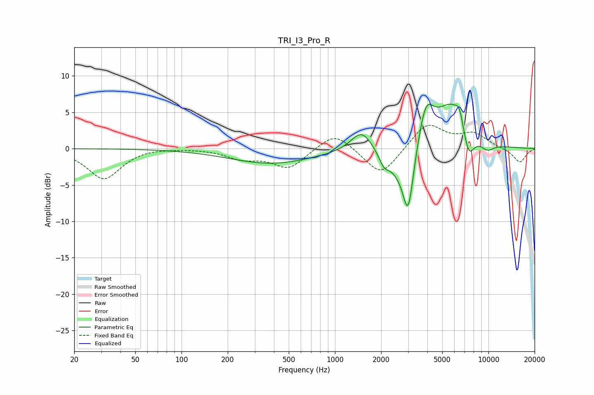

# TRI_I3_Pro_R
See [usage instructions](https://github.com/jaakkopasanen/AutoEq#usage) for more options and info.

### Parametric EQs
Apply preamp of -6.2 dB when using parametric equalizer.

|   # | Type    |   Fc (Hz) |    Q |   Gain (dB) |
|-----|---------|-----------|------|-------------|
|   1 | Peaking |       387 | 0.52 |        -2   |
|   2 | Peaking |      1492 | 2.06 |         2.9 |
|   3 | Peaking |      2086 | 4.51 |        -1.5 |
|   4 | Peaking |      2547 | 1.68 |        -2.6 |
|   5 | Peaking |      3003 | 3.85 |        -8.7 |
|   6 | Peaking |      3914 | 2.76 |         5.4 |
|   7 | Peaking |      5789 | 1.29 |         6.1 |
|   8 | Peaking |      6470 | 6    |         1.7 |
|   9 | Peaking |      7431 | 3.49 |        -4.1 |
|  10 | Peaking |      9820 | 2.66 |        -1.2 |

### Fixed Band EQs
When using fixed band (also called graphic) equalizer, apply preamp of **-3.3 dB** (if available) and set gains manually with these parameters.

|   # | Type    |   Fc (Hz) |    Q |   Gain (dB) |
|-----|---------|-----------|------|-------------|
|   1 | Peaking |        31 | 1.41 |        -4.2 |
|   2 | Peaking |        62 | 1.41 |         0.2 |
|   3 | Peaking |       125 | 1.41 |         0.1 |
|   4 | Peaking |       250 | 1.41 |        -1.2 |
|   5 | Peaking |       500 | 1.41 |        -2.7 |
|   6 | Peaking |      1000 | 1.41 |         2.5 |
|   7 | Peaking |      2000 | 1.41 |        -3.9 |
|   8 | Peaking |      4000 | 1.41 |         3.5 |
|   9 | Peaking |      8000 | 1.41 |         1.9 |
|  10 | Peaking |     16000 | 1.41 |        -1.9 |

### Graphs

