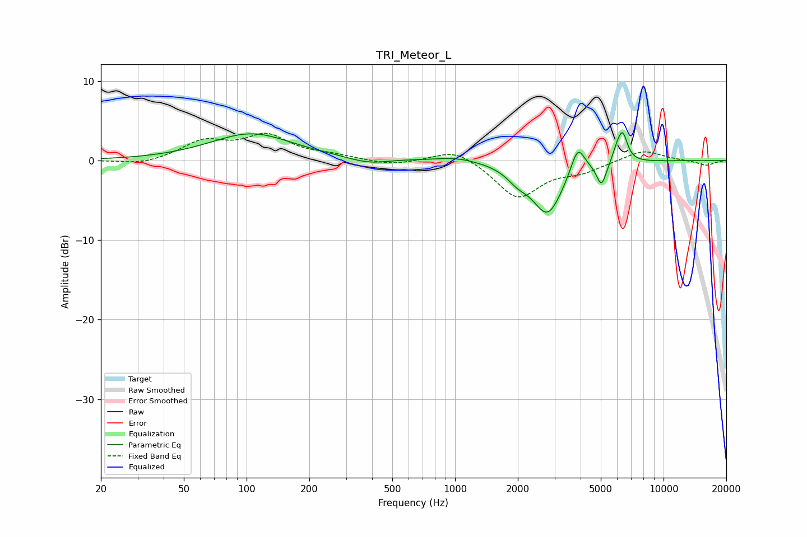

# TRI_Meteor_L
See [usage instructions](https://github.com/jaakkopasanen/AutoEq#usage) for more options and info.

### Parametric EQs
Apply preamp of -3.6 dB when using parametric equalizer.

|   # | Type    |   Fc (Hz) |    Q |   Gain (dB) |
|-----|---------|-----------|------|-------------|
|   1 | Peaking |       105 | 0.72 |         3.4 |
|   2 | Peaking |       337 | 2    |        -0.2 |
|   3 | Peaking |       401 | 1.78 |        -0.5 |
|   4 | Peaking |      1017 | 1.38 |         0.5 |
|   5 | Peaking |      1994 | 2.71 |        -1.3 |
|   6 | Peaking |      2779 | 1.91 |        -6.6 |
|   7 | Peaking |      3877 | 4.19 |         3.5 |
|   8 | Peaking |      5042 | 5.97 |        -2.9 |
|   9 | Peaking |      6002 | 6    |         1.4 |
|  10 | Peaking |      6375 | 5.92 |         3.2 |

### Fixed Band EQs
When using fixed band (also called graphic) equalizer, apply preamp of **-3.5 dB** (if available) and set gains manually with these parameters.

|   # | Type    |   Fc (Hz) |    Q |   Gain (dB) |
|-----|---------|-----------|------|-------------|
|   1 | Peaking |        31 | 1.41 |        -0.6 |
|   2 | Peaking |        62 | 1.41 |         2.3 |
|   3 | Peaking |       125 | 1.41 |         2.9 |
|   4 | Peaking |       250 | 1.41 |         0.5 |
|   5 | Peaking |       500 | 1.41 |        -0.6 |
|   6 | Peaking |      1000 | 1.41 |         1.6 |
|   7 | Peaking |      2000 | 1.41 |        -4.7 |
|   8 | Peaking |      4000 | 1.41 |        -1.2 |
|   9 | Peaking |      8000 | 1.41 |         1.4 |
|  10 | Peaking |     16000 | 1.41 |        -0.6 |

### Graphs

