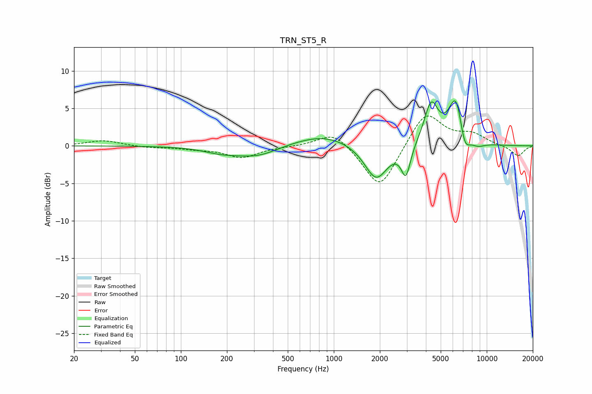

# TRN_ST5_R
See [usage instructions](https://github.com/jaakkopasanen/AutoEq#usage) for more options and info.

### Parametric EQs
Apply preamp of -6.1 dB when using parametric equalizer.

|   # | Type    |   Fc (Hz) |    Q |   Gain (dB) |
|-----|---------|-----------|------|-------------|
|   1 | Peaking |       181 | 1.28 |        -0.6 |
|   2 | Peaking |       318 | 0.92 |        -1.5 |
|   3 | Peaking |       474 | 1.01 |         0.2 |
|   4 | Peaking |       860 | 0.77 |         1.5 |
|   5 | Peaking |      1890 | 1.87 |        -4.7 |
|   6 | Peaking |      2961 | 4.72 |        -4   |
|   7 | Peaking |      4332 | 3.02 |         5.4 |
|   8 | Peaking |      6312 | 2.75 |         6.8 |
|   9 | Peaking |      7141 | 3.81 |        -3.4 |
|  10 | Peaking |      8697 | 2.71 |        -0.7 |

### Fixed Band EQs
When using fixed band (also called graphic) equalizer, apply preamp of **-4.1 dB** (if available) and set gains manually with these parameters.

|   # | Type    |   Fc (Hz) |    Q |   Gain (dB) |
|-----|---------|-----------|------|-------------|
|   1 | Peaking |        31 | 1.41 |         0.7 |
|   2 | Peaking |        62 | 1.41 |        -0.2 |
|   3 | Peaking |       125 | 1.41 |        -0.3 |
|   4 | Peaking |       250 | 1.41 |        -1.5 |
|   5 | Peaking |       500 | 1.41 |        -0.1 |
|   6 | Peaking |      1000 | 1.41 |         2.1 |
|   7 | Peaking |      2000 | 1.41 |        -6   |
|   8 | Peaking |      4000 | 1.41 |         4.7 |
|   9 | Peaking |      8000 | 1.41 |         1.4 |
|  10 | Peaking |     16000 | 1.41 |        -1.4 |

### Graphs

