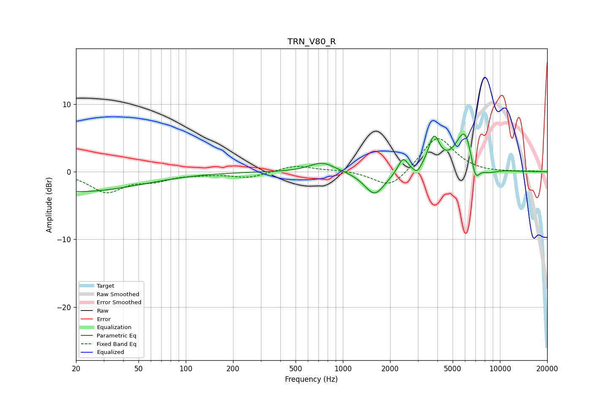

# TRN_V80_R
See [usage instructions](https://github.com/jaakkopasanen/AutoEq#usage) for more options and info.

### Parametric EQs
Apply preamp of -5.6 dB when using parametric equalizer.

|   # | Type    |   Fc (Hz) |    Q |   Gain (dB) |
|-----|---------|-----------|------|-------------|
|   1 | Peaking |        20 | 0.34 |        -3   |
|   2 | Peaking |       739 | 1.75 |         1.5 |
|   3 | Peaking |      1593 | 2.18 |        -3.5 |
|   4 | Peaking |      2413 | 4.64 |         2.3 |
|   5 | Peaking |      2968 | 5.98 |        -1   |
|   6 | Peaking |      3680 | 1.48 |        -0.7 |
|   7 | Peaking |      3799 | 3.69 |         5.2 |
|   8 | Peaking |      6023 | 2.25 |         6.8 |
|   9 | Peaking |      6946 | 4.38 |        -4.1 |
|  10 | Peaking |      8307 | 2.28 |        -1   |

### Fixed Band EQs
When using fixed band (also called graphic) equalizer, apply preamp of **-5.0 dB** (if available) and set gains manually with these parameters.

|   # | Type    |   Fc (Hz) |    Q |   Gain (dB) |
|-----|---------|-----------|------|-------------|
|   1 | Peaking |        31 | 1.41 |        -2.9 |
|   2 | Peaking |        62 | 1.41 |        -1.1 |
|   3 | Peaking |       125 | 1.41 |        -0.2 |
|   4 | Peaking |       250 | 1.41 |        -0.9 |
|   5 | Peaking |       500 | 1.41 |         1   |
|   6 | Peaking |      1000 | 1.41 |         0.2 |
|   7 | Peaking |      2000 | 1.41 |        -2.6 |
|   8 | Peaking |      4000 | 1.41 |         5.3 |
|   9 | Peaking |      8000 | 1.41 |        -0.2 |
|  10 | Peaking |     16000 | 1.41 |         0.1 |

### Graphs

