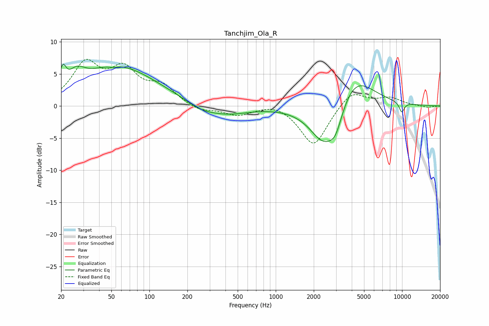

# Tanchjim_Ola_R
See [usage instructions](https://github.com/jaakkopasanen/AutoEq#usage) for more options and info.

### Parametric EQs
Apply preamp of -6.6 dB when using parametric equalizer.

|   # | Type    |   Fc (Hz) |    Q |   Gain (dB) |
|-----|---------|-----------|------|-------------|
|   1 | Peaking |        21 | 6    |         2.7 |
|   2 | Peaking |        27 | 2.32 |         2   |
|   3 | Peaking |        52 | 5.83 |        -0.3 |
|   4 | Peaking |        56 | 0.45 |         6.1 |
|   5 | Peaking |       255 | 1.29 |        -0.9 |
|   6 | Peaking |       405 | 0.79 |        -1.4 |
|   7 | Peaking |      2406 | 1.23 |        -6.5 |
|   8 | Peaking |      2983 | 2.59 |        -3.2 |
|   9 | Peaking |      4156 | 0.94 |         5.4 |
|  10 | Peaking |      9944 | 5.97 |        -1.6 |

### Fixed Band EQs
When using fixed band (also called graphic) equalizer, apply preamp of **-7.4 dB** (if available) and set gains manually with these parameters.

|   # | Type    |   Fc (Hz) |    Q |   Gain (dB) |
|-----|---------|-----------|------|-------------|
|   1 | Peaking |        31 | 1.41 |         6.2 |
|   2 | Peaking |        62 | 1.41 |         5   |
|   3 | Peaking |       125 | 1.41 |         2.8 |
|   4 | Peaking |       250 | 1.41 |        -0.9 |
|   5 | Peaking |       500 | 1.41 |        -1.4 |
|   6 | Peaking |      1000 | 1.41 |         0.7 |
|   7 | Peaking |      2000 | 1.41 |        -6.3 |
|   8 | Peaking |      4000 | 1.41 |         2.6 |
|   9 | Peaking |      8000 | 1.41 |         1.2 |
|  10 | Peaking |     16000 | 1.41 |        -0.3 |

### Graphs

