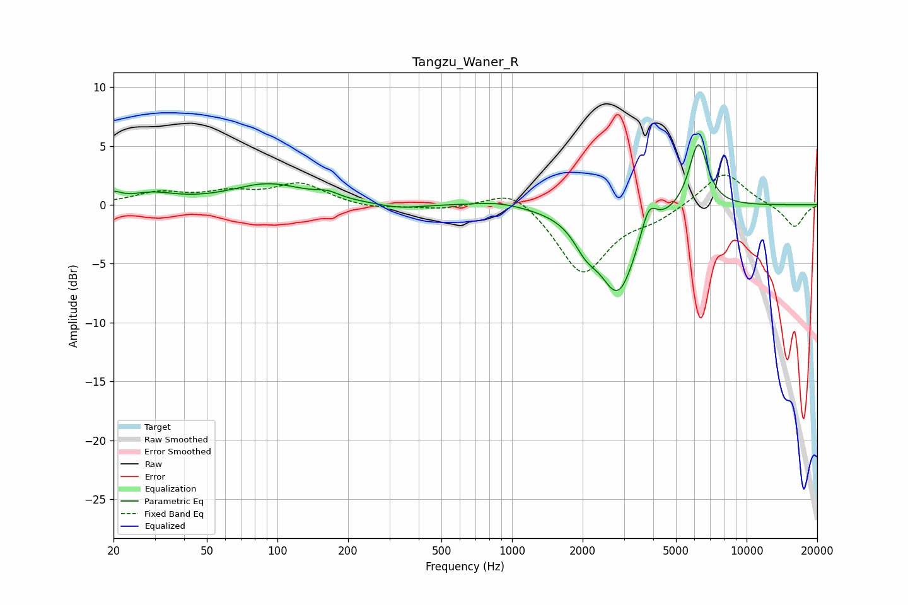

# Tangzu_Waner_R
See [usage instructions](https://github.com/jaakkopasanen/AutoEq#usage) for more options and info.

### Parametric EQs
Apply preamp of -5.2 dB when using parametric equalizer.

|   # | Type    |   Fc (Hz) |    Q |   Gain (dB) |
|-----|---------|-----------|------|-------------|
|   1 | Peaking |        20 | 4.5  |         0.6 |
|   2 | Peaking |        29 | 1.4  |         0.8 |
|   3 | Peaking |        92 | 0.9  |         1.7 |
|   4 | Peaking |       163 | 2.82 |         0.5 |
|   5 | Peaking |       331 | 1.58 |        -0.4 |
|   6 | Peaking |       872 | 1.35 |         0.4 |
|   7 | Peaking |      2062 | 2.77 |        -1.7 |
|   8 | Peaking |      2838 | 1.73 |        -7.3 |
|   9 | Peaking |      3825 | 4.13 |         2.5 |
|  10 | Peaking |      6226 | 3.43 |         5.7 |

### Fixed Band EQs
When using fixed band (also called graphic) equalizer, apply preamp of **-2.6 dB** (if available) and set gains manually with these parameters.

|   # | Type    |   Fc (Hz) |    Q |   Gain (dB) |
|-----|---------|-----------|------|-------------|
|   1 | Peaking |        31 | 1.41 |         1   |
|   2 | Peaking |        62 | 1.41 |         0.9 |
|   3 | Peaking |       125 | 1.41 |         1.7 |
|   4 | Peaking |       250 | 1.41 |        -0.4 |
|   5 | Peaking |       500 | 1.41 |        -0.3 |
|   6 | Peaking |      1000 | 1.41 |         1.6 |
|   7 | Peaking |      2000 | 1.41 |        -5.9 |
|   8 | Peaking |      4000 | 1.41 |        -1   |
|   9 | Peaking |      8000 | 1.41 |         2.9 |
|  10 | Peaking |     16000 | 1.41 |        -2   |

### Graphs

