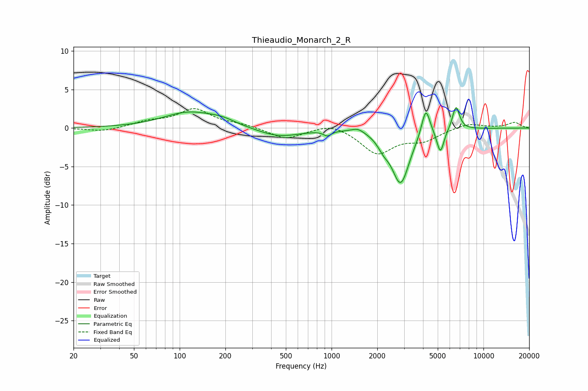

# Thieaudio_Monarch_2_R
See [usage instructions](https://github.com/jaakkopasanen/AutoEq#usage) for more options and info.

### Parametric EQs
Apply preamp of -2.8 dB when using parametric equalizer.

|   # | Type    |   Fc (Hz) |    Q |   Gain (dB) |
|-----|---------|-----------|------|-------------|
|   1 | Peaking |       116 | 0.82 |         2   |
|   2 | Peaking |       191 | 1.6  |         0.6 |
|   3 | Peaking |       450 | 1    |        -1.2 |
|   4 | Peaking |       938 | 5.8  |        -0.6 |
|   5 | Peaking |      1489 | 3.31 |         0.6 |
|   6 | Peaking |      2197 | 3.75 |        -1.1 |
|   7 | Peaking |      2849 | 2.45 |        -7   |
|   8 | Peaking |      4172 | 5.08 |         3.7 |
|   9 | Peaking |      5206 | 5.98 |        -3.1 |
|  10 | Peaking |      6593 | 5.85 |         3.1 |

### Fixed Band EQs
When using fixed band (also called graphic) equalizer, apply preamp of **-2.6 dB** (if available) and set gains manually with these parameters.

|   # | Type    |   Fc (Hz) |    Q |   Gain (dB) |
|-----|---------|-----------|------|-------------|
|   1 | Peaking |        31 | 1.41 |        -0.5 |
|   2 | Peaking |        62 | 1.41 |         0.7 |
|   3 | Peaking |       125 | 1.41 |         2.4 |
|   4 | Peaking |       250 | 1.41 |         0.4 |
|   5 | Peaking |       500 | 1.41 |        -1.4 |
|   6 | Peaking |      1000 | 1.41 |         0.8 |
|   7 | Peaking |      2000 | 1.41 |        -3.2 |
|   8 | Peaking |      4000 | 1.41 |        -1.4 |
|   9 | Peaking |      8000 | 1.41 |         0.7 |
|  10 | Peaking |     16000 | 1.41 |         0.7 |

### Graphs

