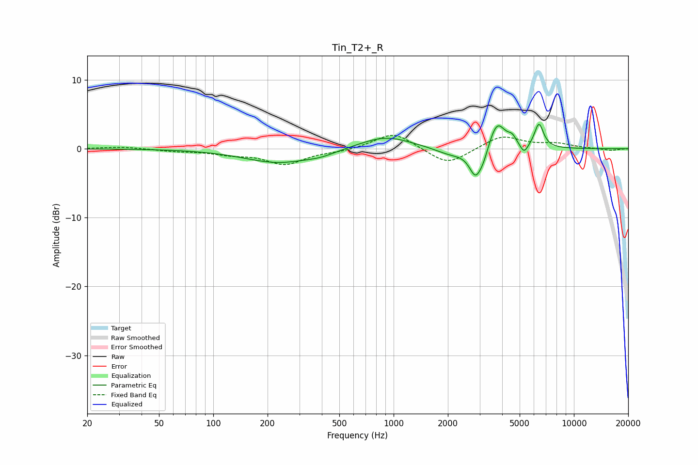

# Tin_T2+_R
See [usage instructions](https://github.com/jaakkopasanen/AutoEq#usage) for more options and info.

### Parametric EQs
Apply preamp of -3.6 dB when using parametric equalizer.

|   # | Type    |   Fc (Hz) |    Q |   Gain (dB) |
|-----|---------|-----------|------|-------------|
|   1 | Peaking |       230 | 0.74 |        -2   |
|   2 | Peaking |       396 | 1.76 |        -0.5 |
|   3 | Peaking |       900 | 0.97 |         1.9 |
|   4 | Peaking |      2092 | 1.57 |        -1   |
|   5 | Peaking |      2848 | 4.09 |        -3.9 |
|   6 | Peaking |      3155 | 5.1  |        -1.4 |
|   7 | Peaking |      3750 | 3.11 |         4.1 |
|   8 | Peaking |      4550 | 5.9  |         1.1 |
|   9 | Peaking |      5293 | 6    |        -1.5 |
|  10 | Peaking |      6399 | 5.44 |         3.5 |

### Fixed Band EQs
When using fixed band (also called graphic) equalizer, apply preamp of **-2.0 dB** (if available) and set gains manually with these parameters.

|   # | Type    |   Fc (Hz) |    Q |   Gain (dB) |
|-----|---------|-----------|------|-------------|
|   1 | Peaking |        31 | 1.41 |         0.3 |
|   2 | Peaking |        62 | 1.41 |        -0.3 |
|   3 | Peaking |       125 | 1.41 |        -0.7 |
|   4 | Peaking |       250 | 1.41 |        -2.2 |
|   5 | Peaking |       500 | 1.41 |        -0.3 |
|   6 | Peaking |      1000 | 1.41 |         2.5 |
|   7 | Peaking |      2000 | 1.41 |        -2.5 |
|   8 | Peaking |      4000 | 1.41 |         1.9 |
|   9 | Peaking |      8000 | 1.41 |         0.7 |
|  10 | Peaking |     16000 | 1.41 |        -0.3 |

### Graphs

