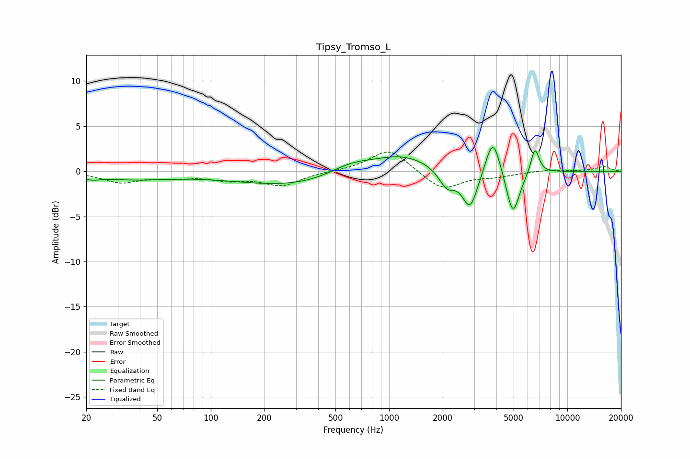

# Tipsy_Tromso_L
See [usage instructions](https://github.com/jaakkopasanen/AutoEq#usage) for more options and info.

### Parametric EQs
Apply preamp of -2.7 dB when using parametric equalizer.

|   # | Type    |   Fc (Hz) |    Q |   Gain (dB) |
|-----|---------|-----------|------|-------------|
|   1 | Peaking |        21 | 3.05 |        -0.4 |
|   2 | Peaking |        36 | 0.64 |        -0.8 |
|   3 | Peaking |       390 | 0.33 |        -1.9 |
|   4 | Peaking |       611 | 1.02 |         1.7 |
|   5 | Peaking |      1174 | 0.81 |         2.3 |
|   6 | Peaking |      2109 | 3.13 |        -2   |
|   7 | Peaking |      2848 | 3.16 |        -4.3 |
|   8 | Peaking |      3823 | 3.37 |         4.4 |
|   9 | Peaking |      4947 | 3.68 |        -5.1 |
|  10 | Peaking |      6580 | 5.92 |         2.9 |

### Fixed Band EQs
When using fixed band (also called graphic) equalizer, apply preamp of **-2.2 dB** (if available) and set gains manually with these parameters.

|   # | Type    |   Fc (Hz) |    Q |   Gain (dB) |
|-----|---------|-----------|------|-------------|
|   1 | Peaking |        31 | 1.41 |        -1.2 |
|   2 | Peaking |        62 | 1.41 |        -0.5 |
|   3 | Peaking |       125 | 1.41 |        -0.8 |
|   4 | Peaking |       250 | 1.41 |        -1.5 |
|   5 | Peaking |       500 | 1.41 |         0   |
|   6 | Peaking |      1000 | 1.41 |         2.6 |
|   7 | Peaking |      2000 | 1.41 |        -2.1 |
|   8 | Peaking |      4000 | 1.41 |        -0.5 |
|   9 | Peaking |      8000 | 1.41 |         0.2 |
|  10 | Peaking |     16000 | 1.41 |         0.5 |

### Graphs

