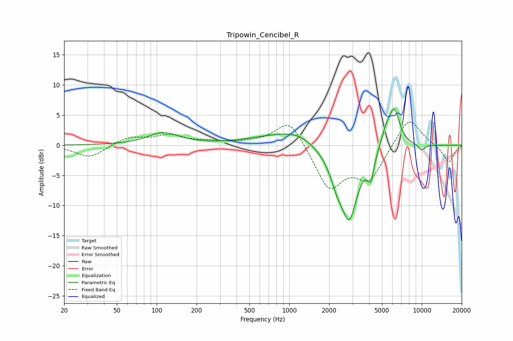

# Tripowin_Cencibel_R
See [usage instructions](https://github.com/jaakkopasanen/AutoEq#usage) for more options and info.

### Parametric EQs
Apply preamp of -6.1 dB when using parametric equalizer.

|   # | Type    |   Fc (Hz) |    Q |   Gain (dB) |
|-----|---------|-----------|------|-------------|
|   1 | Peaking |       112 | 1.2  |         2   |
|   2 | Peaking |      1067 | 0.55 |         2.2 |
|   3 | Peaking |      1187 | 1.41 |         0.4 |
|   4 | Peaking |      1655 | 2.01 |        -0.4 |
|   5 | Peaking |      2272 | 2.7  |        -3.1 |
|   6 | Peaking |      2832 | 2.04 |       -12   |
|   7 | Peaking |      4119 | 6    |        -3.7 |
|   8 | Peaking |      5393 | 3.71 |         2.4 |
|   9 | Peaking |      6209 | 3.27 |         5.9 |
|  10 | Peaking |     10000 | 5.12 |        -1   |

### Fixed Band EQs
When using fixed band (also called graphic) equalizer, apply preamp of **-3.9 dB** (if available) and set gains manually with these parameters.

|   # | Type    |   Fc (Hz) |    Q |   Gain (dB) |
|-----|---------|-----------|------|-------------|
|   1 | Peaking |        31 | 1.41 |        -2.1 |
|   2 | Peaking |        62 | 1.41 |         1.4 |
|   3 | Peaking |       125 | 1.41 |         1.5 |
|   4 | Peaking |       250 | 1.41 |         0.5 |
|   5 | Peaking |       500 | 1.41 |         0.3 |
|   6 | Peaking |      1000 | 1.41 |         4.6 |
|   7 | Peaking |      2000 | 1.41 |        -7.2 |
|   8 | Peaking |      4000 | 1.41 |        -5.4 |
|   9 | Peaking |      8000 | 1.41 |         4.9 |
|  10 | Peaking |     16000 | 1.41 |        -2.9 |

### Graphs

