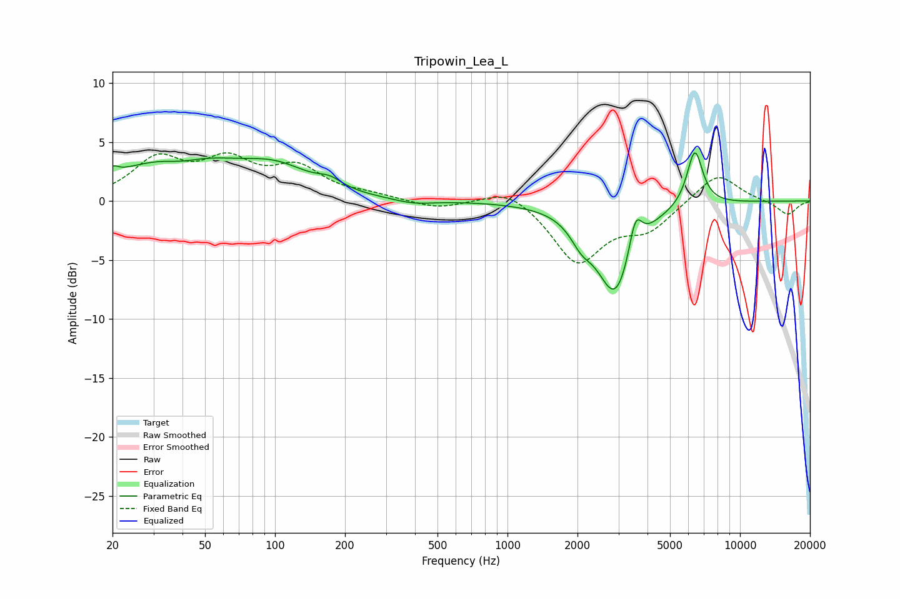

# Tripowin_Lea_L
See [usage instructions](https://github.com/jaakkopasanen/AutoEq#usage) for more options and info.

### Parametric EQs
Apply preamp of -4.2 dB when using parametric equalizer.

|   # | Type    |   Fc (Hz) |    Q |   Gain (dB) |
|-----|---------|-----------|------|-------------|
|   1 | Peaking |        20 | 5.95 |         0.6 |
|   2 | Peaking |        39 | 0.54 |         3.8 |
|   3 | Peaking |        40 | 1.61 |        -0.7 |
|   4 | Peaking |       103 | 0.99 |         1.8 |
|   5 | Peaking |       172 | 2.71 |         0.7 |
|   6 | Peaking |       394 | 1.68 |        -0.4 |
|   7 | Peaking |      2078 | 3.04 |        -1.5 |
|   8 | Peaking |      2915 | 1.74 |        -7.8 |
|   9 | Peaking |      3548 | 5    |         3.2 |
|  10 | Peaking |      6392 | 4.06 |         4.8 |

### Fixed Band EQs
When using fixed band (also called graphic) equalizer, apply preamp of **-4.2 dB** (if available) and set gains manually with these parameters.

|   # | Type    |   Fc (Hz) |    Q |   Gain (dB) |
|-----|---------|-----------|------|-------------|
|   1 | Peaking |        31 | 1.41 |         3.3 |
|   2 | Peaking |        62 | 1.41 |         3   |
|   3 | Peaking |       125 | 1.41 |         2.5 |
|   4 | Peaking |       250 | 1.41 |         0.4 |
|   5 | Peaking |       500 | 1.41 |        -0.7 |
|   6 | Peaking |      1000 | 1.41 |         1.3 |
|   7 | Peaking |      2000 | 1.41 |        -5.1 |
|   8 | Peaking |      4000 | 1.41 |        -2.2 |
|   9 | Peaking |      8000 | 1.41 |         2.5 |
|  10 | Peaking |     16000 | 1.41 |        -1.2 |

### Graphs

