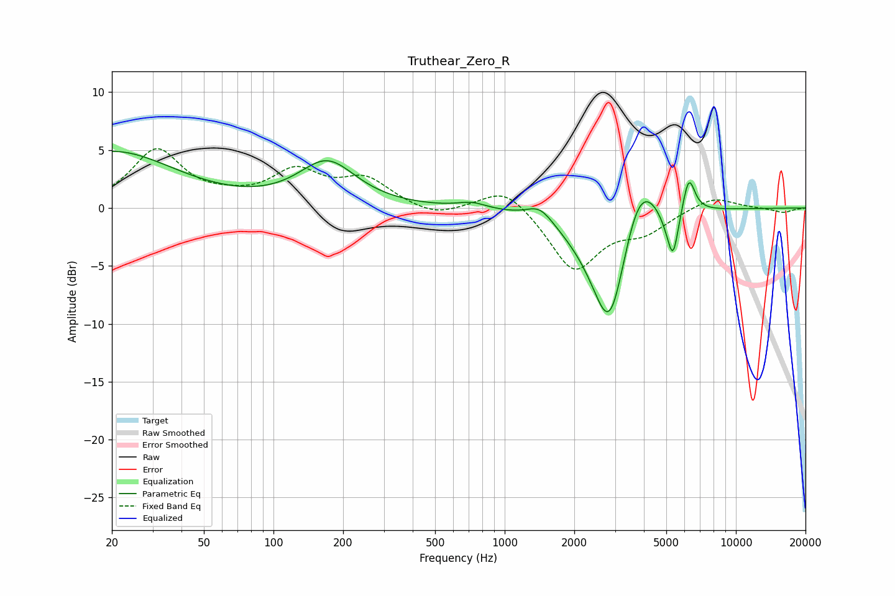

# Truthear_Zero_R
See [usage instructions](https://github.com/jaakkopasanen/AutoEq#usage) for more options and info.

### Parametric EQs
Apply preamp of -5.0 dB when using parametric equalizer.

|   # | Type    |   Fc (Hz) |    Q |   Gain (dB) |
|-----|---------|-----------|------|-------------|
|   1 | Peaking |        20 | 0.52 |         4.8 |
|   2 | Peaking |       171 | 1.15 |         3.8 |
|   3 | Peaking |       722 | 2.24 |         0.5 |
|   4 | Peaking |      1421 | 2.47 |         1.3 |
|   5 | Peaking |      2855 | 1.59 |       -12.3 |
|   6 | Peaking |      3778 | 1.6  |         6.6 |
|   7 | Peaking |      5009 | 3.76 |        -1   |
|   8 | Peaking |      5348 | 5.89 |        -3.9 |
|   9 | Peaking |      6207 | 5.95 |         0.7 |
|  10 | Peaking |      6275 | 5.28 |         2.5 |

### Fixed Band EQs
When using fixed band (also called graphic) equalizer, apply preamp of **-5.2 dB** (if available) and set gains manually with these parameters.

|   # | Type    |   Fc (Hz) |    Q |   Gain (dB) |
|-----|---------|-----------|------|-------------|
|   1 | Peaking |        31 | 1.41 |         4.9 |
|   2 | Peaking |        62 | 1.41 |         0.5 |
|   3 | Peaking |       125 | 1.41 |         2.9 |
|   4 | Peaking |       250 | 1.41 |         2.3 |
|   5 | Peaking |       500 | 1.41 |        -0.9 |
|   6 | Peaking |      1000 | 1.41 |         2   |
|   7 | Peaking |      2000 | 1.41 |        -5.4 |
|   8 | Peaking |      4000 | 1.41 |        -1.8 |
|   9 | Peaking |      8000 | 1.41 |         1.1 |
|  10 | Peaking |     16000 | 1.41 |        -0.4 |

### Graphs

