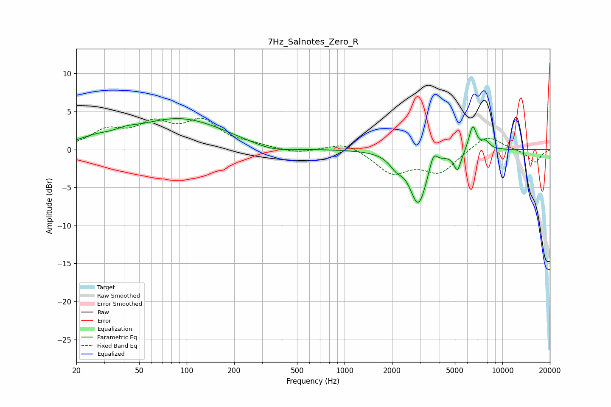

# 7Hz_Salnotes_Zero_R
See [usage instructions](https://github.com/jaakkopasanen/AutoEq#usage) for more options and info.

### Parametric EQs
Apply preamp of -4.2 dB when using parametric equalizer.

|   # | Type    |   Fc (Hz) |    Q |   Gain (dB) |
|-----|---------|-----------|------|-------------|
|   1 | Peaking |        26 | 1.41 |         0.7 |
|   2 | Peaking |        41 | 2.11 |         0.5 |
|   3 | Peaking |        90 | 0.49 |         4   |
|   4 | Peaking |       348 | 1.06 |        -0.8 |
|   5 | Peaking |      2125 | 3.34 |        -1.3 |
|   6 | Peaking |      2936 | 2.59 |        -7   |
|   7 | Peaking |      3655 | 5.66 |         2   |
|   8 | Peaking |      5197 | 5.95 |        -2.5 |
|   9 | Peaking |      6487 | 5.66 |         3.3 |
|  10 | Peaking |      7819 | 4.72 |         1   |

### Fixed Band EQs
When using fixed band (also called graphic) equalizer, apply preamp of **-4.2 dB** (if available) and set gains manually with these parameters.

|   # | Type    |   Fc (Hz) |    Q |   Gain (dB) |
|-----|---------|-----------|------|-------------|
|   1 | Peaking |        31 | 1.41 |         2.2 |
|   2 | Peaking |        62 | 1.41 |         3   |
|   3 | Peaking |       125 | 1.41 |         3.4 |
|   4 | Peaking |       250 | 1.41 |         0.5 |
|   5 | Peaking |       500 | 1.41 |        -0.5 |
|   6 | Peaking |      1000 | 1.41 |         1.1 |
|   7 | Peaking |      2000 | 1.41 |        -3   |
|   8 | Peaking |      4000 | 1.41 |        -2.9 |
|   9 | Peaking |      8000 | 1.41 |         2   |
|  10 | Peaking |     16000 | 1.41 |        -1.7 |

### Graphs

