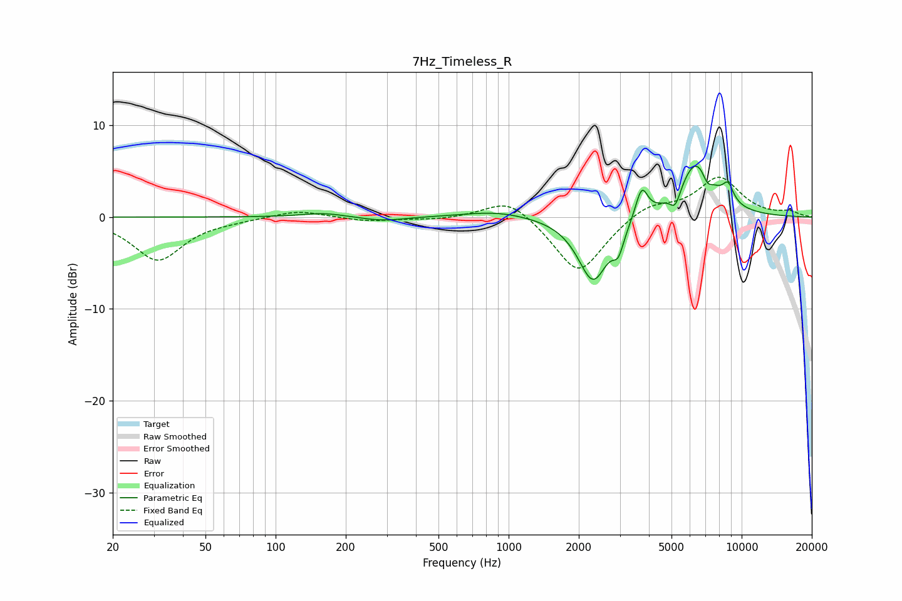

# 7Hz_Timeless_R
See [usage instructions](https://github.com/jaakkopasanen/AutoEq#usage) for more options and info.

### Parametric EQs
Apply preamp of -5.6 dB when using parametric equalizer.

|   # | Type    |   Fc (Hz) |    Q |   Gain (dB) |
|-----|---------|-----------|------|-------------|
|   1 | Peaking |       160 | 1.55 |         0.4 |
|   2 | Peaking |       289 | 1.5  |        -0.5 |
|   3 | Peaking |       888 | 1.01 |         0.7 |
|   4 | Peaking |      2305 | 2.16 |        -7.1 |
|   5 | Peaking |      2957 | 6    |        -2.2 |
|   6 | Peaking |      3723 | 5.34 |         3.4 |
|   7 | Peaking |      5193 | 6    |        -1.9 |
|   8 | Peaking |      6408 | 1.79 |         6.2 |
|   9 | Peaking |      7121 | 6    |        -1.4 |
|  10 | Peaking |      8745 | 5.5  |         1.9 |

### Fixed Band EQs
When using fixed band (also called graphic) equalizer, apply preamp of **-4.4 dB** (if available) and set gains manually with these parameters.

|   # | Type    |   Fc (Hz) |    Q |   Gain (dB) |
|-----|---------|-----------|------|-------------|
|   1 | Peaking |        31 | 1.41 |        -4.7 |
|   2 | Peaking |        62 | 1.41 |        -0.2 |
|   3 | Peaking |       125 | 1.41 |         0.8 |
|   4 | Peaking |       250 | 1.41 |        -0.4 |
|   5 | Peaking |       500 | 1.41 |        -0.3 |
|   6 | Peaking |      1000 | 1.41 |         2.3 |
|   7 | Peaking |      2000 | 1.41 |        -6.3 |
|   8 | Peaking |      4000 | 1.41 |         1.5 |
|   9 | Peaking |      8000 | 1.41 |         4.3 |
|  10 | Peaking |     16000 | 1.41 |         0.5 |

### Graphs

