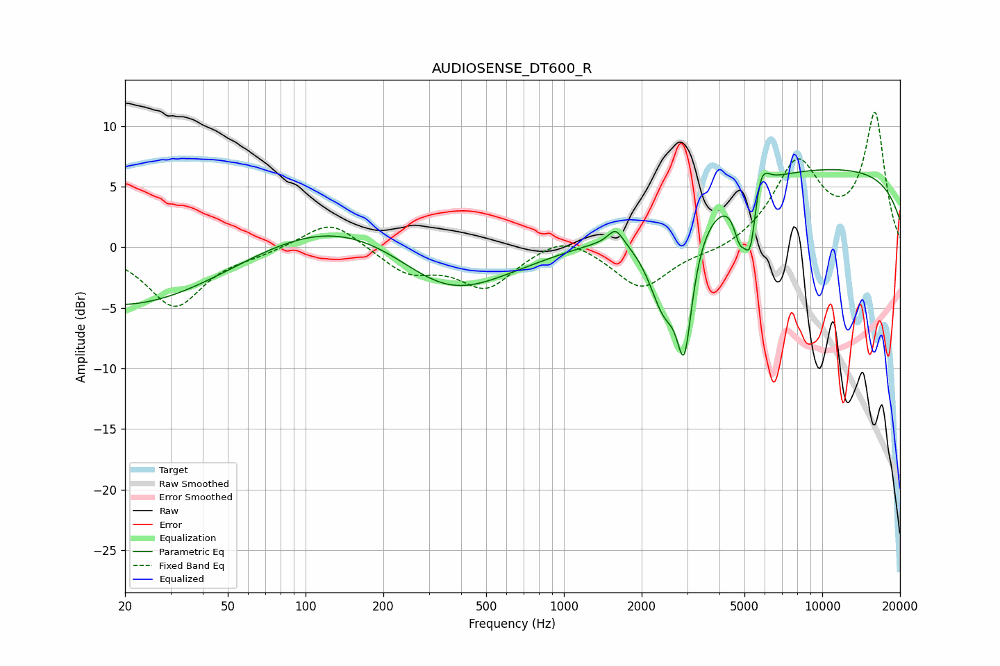

# AUDIOSENSE_DT600_R
See [usage instructions](https://github.com/jaakkopasanen/AutoEq#usage) for more options and info.

### Parametric EQs
Apply preamp of -6.5 dB when using parametric equalizer.

|   # | Type    |   Fc (Hz) |    Q |   Gain (dB) |
|-----|---------|-----------|------|-------------|
|   1 | Peaking |        41 | 0.25 |        -9.1 |
|   2 | Peaking |       135 | 0.25 |        11   |
|   3 | Peaking |       353 | 0.49 |        -9.4 |
|   4 | Peaking |      1586 | 4.95 |         1.3 |
|   5 | Peaking |      2435 | 2.26 |        -6.8 |
|   6 | Peaking |      2925 | 4.64 |        -9   |
|   7 | Peaking |      4795 | 6    |        -2.9 |
|   8 | Peaking |      5273 | 5.86 |        -5.3 |
|   9 | Peaking |      5764 | 4.79 |         2.6 |
|  10 | Peaking |     10000 | 0.18 |         6.5 |

### Fixed Band EQs
When using fixed band (also called graphic) equalizer, apply preamp of **-11.2 dB** (if available) and set gains manually with these parameters.

|   # | Type    |   Fc (Hz) |    Q |   Gain (dB) |
|-----|---------|-----------|------|-------------|
|   1 | Peaking |        31 | 1.41 |        -4.9 |
|   2 | Peaking |        62 | 1.41 |        -0.4 |
|   3 | Peaking |       125 | 1.41 |         2.4 |
|   4 | Peaking |       250 | 1.41 |        -2   |
|   5 | Peaking |       500 | 1.41 |        -3.2 |
|   6 | Peaking |      1000 | 1.41 |         1.4 |
|   7 | Peaking |      2000 | 1.41 |        -3.5 |
|   8 | Peaking |      4000 | 1.41 |        -0.5 |
|   9 | Peaking |      8000 | 1.41 |         6.8 |
|  10 | Peaking |     16000 | 1.41 |        10.9 |

### Graphs

