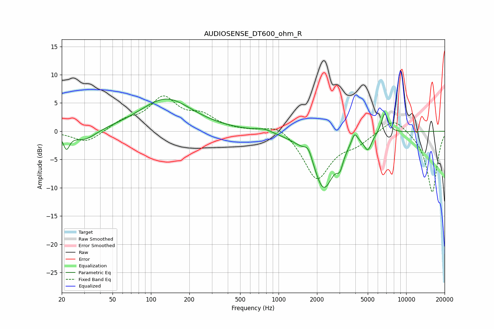

# AUDIOSENSE_DT600_ohm_R
See [usage instructions](https://github.com/jaakkopasanen/AutoEq#usage) for more options and info.

### Parametric EQs
Apply preamp of -5.8 dB when using parametric equalizer.

|   # | Type    |   Fc (Hz) |    Q |   Gain (dB) |
|-----|---------|-----------|------|-------------|
|   1 | Peaking |        22 | 5.89 |        -2.7 |
|   2 | Peaking |        30 | 1.58 |        -1.9 |
|   3 | Peaking |       132 | 0.69 |         5.7 |
|   4 | Peaking |       773 | 2.3  |         0.6 |
|   5 | Peaking |      1715 | 4.25 |         2.1 |
|   6 | Peaking |      2255 | 1.62 |       -10.1 |
|   7 | Peaking |      3026 | 5.84 |        -2.3 |
|   8 | Peaking |      3939 | 6    |         2   |
|   9 | Peaking |      5009 | 4.87 |        -2.6 |
|  10 | Peaking |      6795 | 5.03 |         3.8 |

### Fixed Band EQs
When using fixed band (also called graphic) equalizer, apply preamp of **-6.3 dB** (if available) and set gains manually with these parameters.

|   # | Type    |   Fc (Hz) |    Q |   Gain (dB) |
|-----|---------|-----------|------|-------------|
|   1 | Peaking |        31 | 1.41 |        -2.1 |
|   2 | Peaking |        62 | 1.41 |         1.6 |
|   3 | Peaking |       125 | 1.41 |         5.6 |
|   4 | Peaking |       250 | 1.41 |         2.4 |
|   5 | Peaking |       500 | 1.41 |         0.1 |
|   6 | Peaking |      1000 | 1.41 |         1.7 |
|   7 | Peaking |      2000 | 1.41 |        -8.5 |
|   8 | Peaking |      4000 | 1.41 |        -1.7 |
|   9 | Peaking |      8000 | 1.41 |         2.7 |
|  10 | Peaking |     16000 | 1.41 |       -10.9 |

### Graphs

