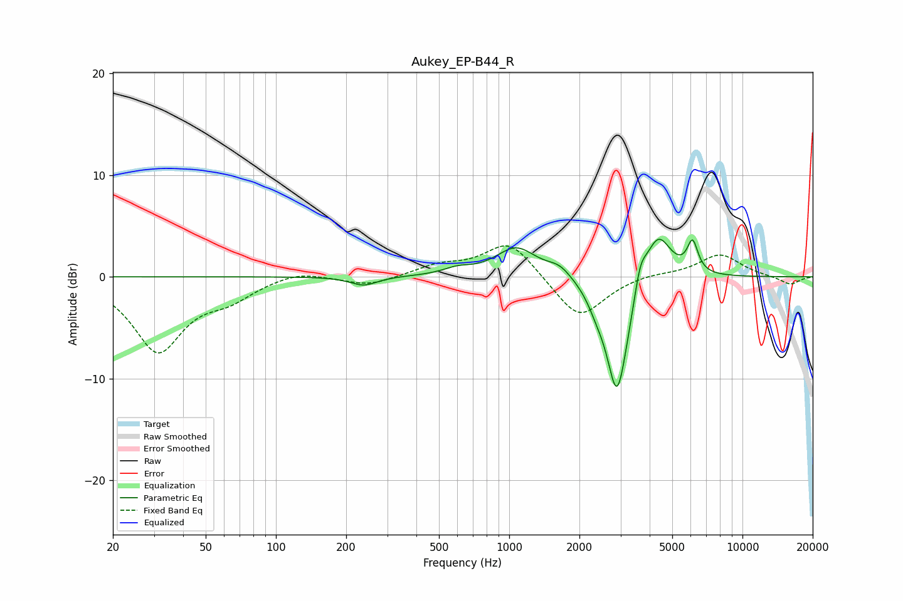

# Aukey_EP-B44_R
See [usage instructions](https://github.com/jaakkopasanen/AutoEq#usage) for more options and info.

### Parametric EQs
Apply preamp of -3.8 dB when using parametric equalizer.

|   # | Type    |   Fc (Hz) |    Q |   Gain (dB) |
|-----|---------|-----------|------|-------------|
|   1 | Peaking |       238 | 2.45 |        -0.9 |
|   2 | Peaking |       600 | 2.34 |         0.6 |
|   3 | Peaking |      1073 | 1.62 |         2.9 |
|   4 | Peaking |      1643 | 2.69 |         1   |
|   5 | Peaking |      2367 | 3.75 |        -1.2 |
|   6 | Peaking |      2894 | 3.12 |       -10.5 |
|   7 | Peaking |      3109 | 2.31 |        -1.7 |
|   8 | Peaking |      3646 | 5.45 |         2.6 |
|   9 | Peaking |      4333 | 2.48 |         4.8 |
|  10 | Peaking |      6110 | 6    |         3   |

### Fixed Band EQs
When using fixed band (also called graphic) equalizer, apply preamp of **-3.1 dB** (if available) and set gains manually with these parameters.

|   # | Type    |   Fc (Hz) |    Q |   Gain (dB) |
|-----|---------|-----------|------|-------------|
|   1 | Peaking |        31 | 1.41 |        -7.2 |
|   2 | Peaking |        62 | 1.41 |        -1.7 |
|   3 | Peaking |       125 | 1.41 |         0.7 |
|   4 | Peaking |       250 | 1.41 |        -0.9 |
|   5 | Peaking |       500 | 1.41 |         1   |
|   6 | Peaking |      1000 | 1.41 |         3.6 |
|   7 | Peaking |      2000 | 1.41 |        -4.3 |
|   8 | Peaking |      4000 | 1.41 |         0.3 |
|   9 | Peaking |      8000 | 1.41 |         2.2 |
|  10 | Peaking |     16000 | 1.41 |        -0.8 |

### Graphs

