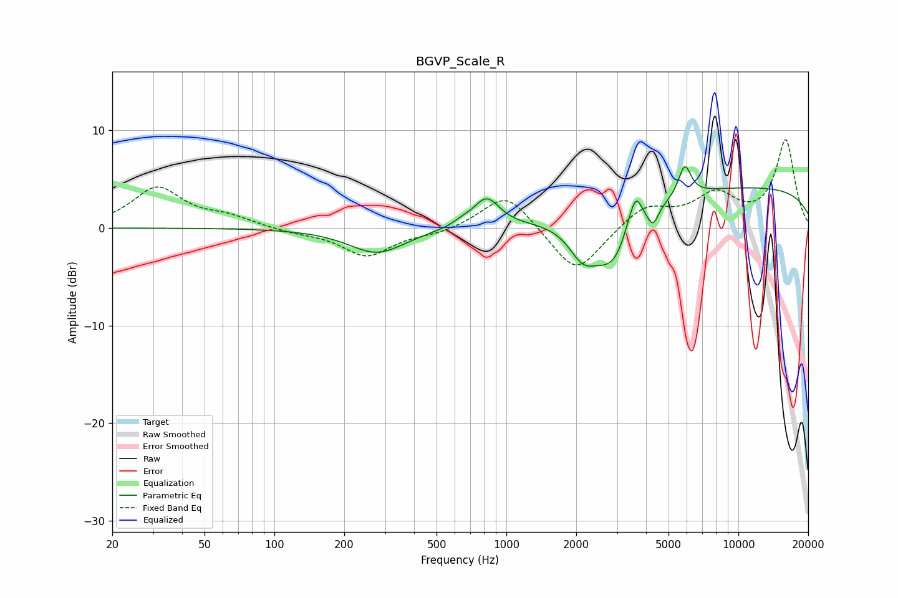

# BGVP_Scale_R
See [usage instructions](https://github.com/jaakkopasanen/AutoEq#usage) for more options and info.

### Parametric EQs
Apply preamp of -6.4 dB when using parametric equalizer.

|   # | Type    |   Fc (Hz) |    Q |   Gain (dB) |
|-----|---------|-----------|------|-------------|
|   1 | Peaking |       277 | 1.16 |        -2.6 |
|   2 | Peaking |       644 | 3.61 |         0.4 |
|   3 | Peaking |       821 | 2.55 |         2.9 |
|   4 | Peaking |      2130 | 2.37 |        -3   |
|   5 | Peaking |      2878 | 1.54 |        -5.8 |
|   6 | Peaking |      3295 | 5.99 |         0.5 |
|   7 | Peaking |      3603 | 4.93 |         3.6 |
|   8 | Peaking |      4283 | 6    |        -1.8 |
|   9 | Peaking |      5873 | 5.14 |         3.2 |
|  10 | Peaking |     10000 | 0.18 |         4.2 |

### Fixed Band EQs
When using fixed band (also called graphic) equalizer, apply preamp of **-9.1 dB** (if available) and set gains manually with these parameters.

|   # | Type    |   Fc (Hz) |    Q |   Gain (dB) |
|-----|---------|-----------|------|-------------|
|   1 | Peaking |        31 | 1.41 |         4.1 |
|   2 | Peaking |        62 | 1.41 |         1   |
|   3 | Peaking |       125 | 1.41 |        -0.4 |
|   4 | Peaking |       250 | 1.41 |        -2.9 |
|   5 | Peaking |       500 | 1.41 |        -0.5 |
|   6 | Peaking |      1000 | 1.41 |         3.8 |
|   7 | Peaking |      2000 | 1.41 |        -4.9 |
|   8 | Peaking |      4000 | 1.41 |         2.3 |
|   9 | Peaking |      8000 | 1.41 |         3.2 |
|  10 | Peaking |     16000 | 1.41 |         8.9 |

### Graphs

