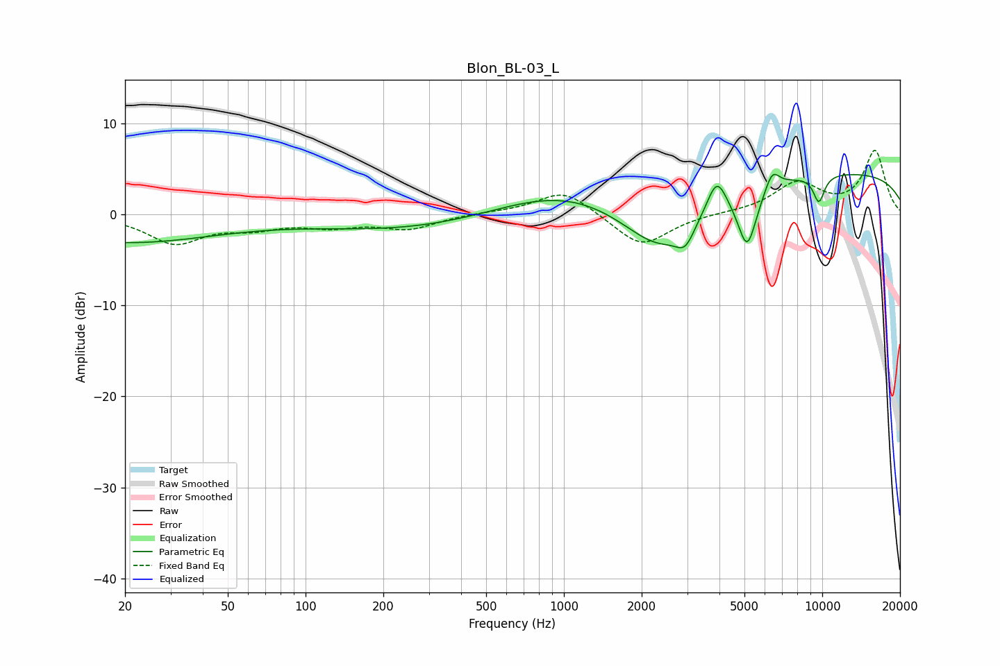

# Blon_BL-03_L
See [usage instructions](https://github.com/jaakkopasanen/AutoEq#usage) for more options and info.

### Parametric EQs
Apply preamp of -4.5 dB when using parametric equalizer.

|   # | Type    |   Fc (Hz) |    Q |   Gain (dB) |
|-----|---------|-----------|------|-------------|
|   1 | Peaking |        20 | 0.39 |        -3   |
|   2 | Peaking |       296 | 0.35 |        -1.9 |
|   3 | Peaking |       974 | 0.5  |         3.3 |
|   4 | Peaking |      2369 | 0.89 |        -6.8 |
|   5 | Peaking |      2950 | 3.95 |        -2.2 |
|   6 | Peaking |      3905 | 3.79 |         3.7 |
|   7 | Peaking |      5124 | 3.71 |        -6.4 |
|   8 | Peaking |      6405 | 4.89 |         2.1 |
|   9 | Peaking |      9706 | 5.63 |        -3   |
|  10 | Peaking |     10000 | 0.18 |         4.7 |

### Fixed Band EQs
When using fixed band (also called graphic) equalizer, apply preamp of **-7.1 dB** (if available) and set gains manually with these parameters.

|   # | Type    |   Fc (Hz) |    Q |   Gain (dB) |
|-----|---------|-----------|------|-------------|
|   1 | Peaking |        31 | 1.41 |        -3.1 |
|   2 | Peaking |        62 | 1.41 |        -1.2 |
|   3 | Peaking |       125 | 1.41 |        -1.1 |
|   4 | Peaking |       250 | 1.41 |        -1.5 |
|   5 | Peaking |       500 | 1.41 |         0.2 |
|   6 | Peaking |      1000 | 1.41 |         2.7 |
|   7 | Peaking |      2000 | 1.41 |        -3.6 |
|   8 | Peaking |      4000 | 1.41 |         0.1 |
|   9 | Peaking |      8000 | 1.41 |         3.3 |
|  10 | Peaking |     16000 | 1.41 |         6.9 |

### Graphs

