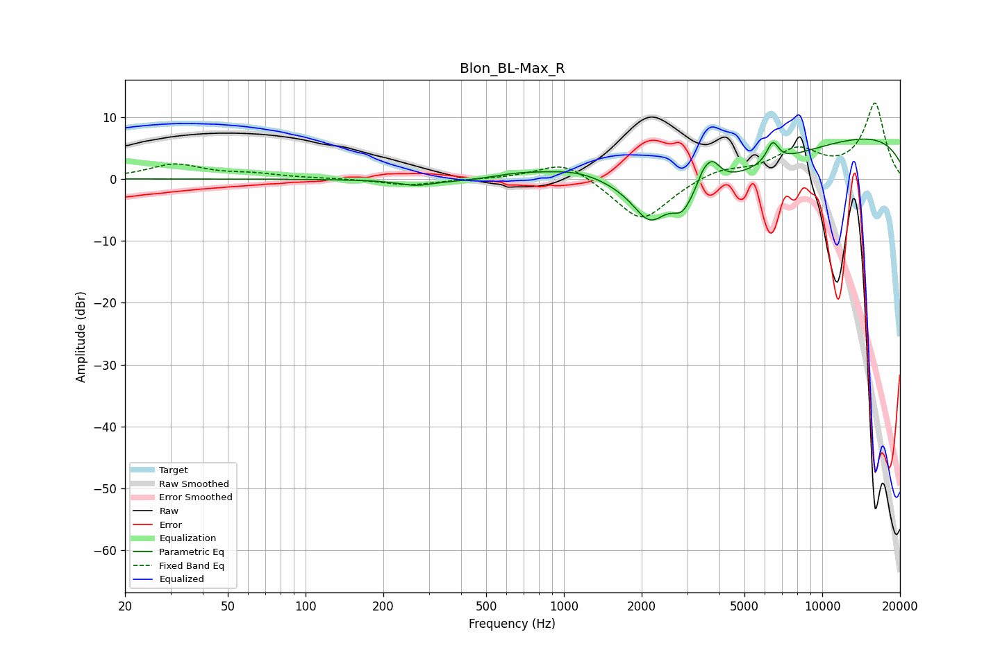

# Blon_BL-Max_R
See [usage instructions](https://github.com/jaakkopasanen/AutoEq#usage) for more options and info.

### Parametric EQs
Apply preamp of -6.5 dB when using parametric equalizer.

|   # | Type    |   Fc (Hz) |    Q |   Gain (dB) |
|-----|---------|-----------|------|-------------|
|   1 | Peaking |       267 | 2.2  |        -0.8 |
|   2 | Peaking |       652 | 1.21 |         1.2 |
|   3 | Peaking |      1153 | 0.76 |         5.3 |
|   4 | Peaking |      2147 | 2.3  |        -5.1 |
|   5 | Peaking |      2524 | 0.29 |        -8   |
|   6 | Peaking |      2877 | 3.79 |        -3.1 |
|   7 | Peaking |      3473 | 5.78 |         1.9 |
|   8 | Peaking |      3764 | 4.5  |         3.3 |
|   9 | Peaking |      6426 | 5.85 |         3.3 |
|  10 | Peaking |     10000 | 0.18 |         8.1 |

### Fixed Band EQs
When using fixed band (also called graphic) equalizer, apply preamp of **-12.3 dB** (if available) and set gains manually with these parameters.

|   # | Type    |   Fc (Hz) |    Q |   Gain (dB) |
|-----|---------|-----------|------|-------------|
|   1 | Peaking |        31 | 1.41 |         2.3 |
|   2 | Peaking |        62 | 1.41 |         0.7 |
|   3 | Peaking |       125 | 1.41 |         0.1 |
|   4 | Peaking |       250 | 1.41 |        -1   |
|   5 | Peaking |       500 | 1.41 |        -0   |
|   6 | Peaking |      1000 | 1.41 |         3.1 |
|   7 | Peaking |      2000 | 1.41 |        -7.1 |
|   8 | Peaking |      4000 | 1.41 |         1.7 |
|   9 | Peaking |      8000 | 1.41 |         4.3 |
|  10 | Peaking |     16000 | 1.41 |        12.1 |

### Graphs

