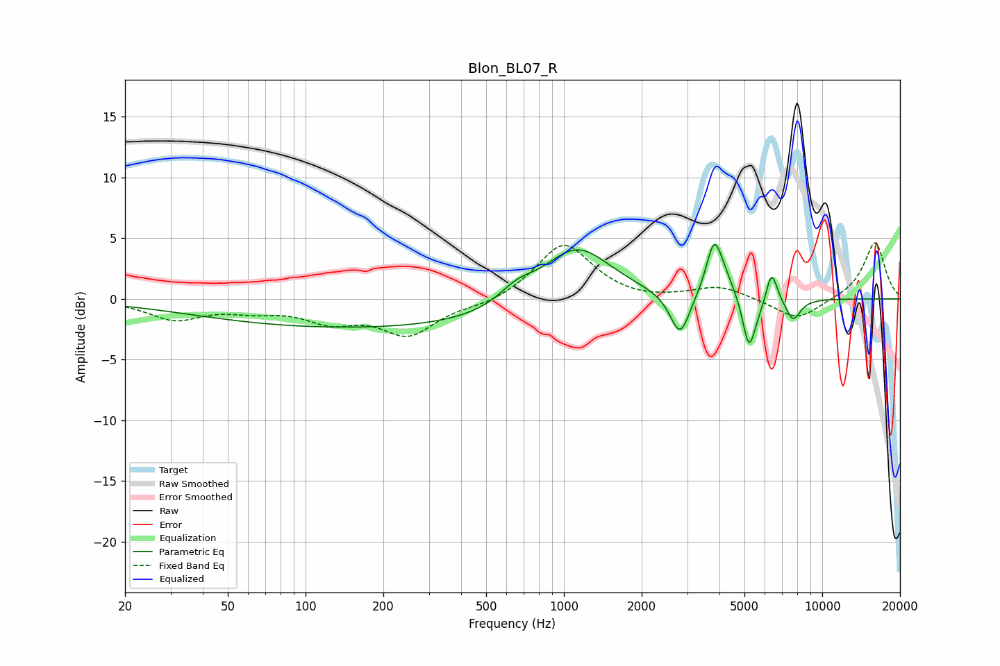

# Blon_BL07_R
See [usage instructions](https://github.com/jaakkopasanen/AutoEq#usage) for more options and info.

### Parametric EQs
Apply preamp of -4.6 dB when using parametric equalizer.

|   # | Type    |   Fc (Hz) |    Q |   Gain (dB) |
|-----|---------|-----------|------|-------------|
|   1 | Peaking |       192 | 0.18 |        -2.5 |
|   2 | Peaking |       656 | 2.1  |         1.2 |
|   3 | Peaking |      1114 | 1.01 |         5.1 |
|   4 | Peaking |      2817 | 3.66 |        -3.7 |
|   5 | Peaking |      3816 | 4.62 |         4   |
|   6 | Peaking |      4179 | 2.69 |         1.4 |
|   7 | Peaking |      5198 | 6    |        -3.6 |
|   8 | Peaking |      5558 | 2.59 |        -1.3 |
|   9 | Peaking |      6365 | 5.98 |         3   |
|  10 | Peaking |      7715 | 4.69 |        -1.8 |

### Fixed Band EQs
When using fixed band (also called graphic) equalizer, apply preamp of **-4.7 dB** (if available) and set gains manually with these parameters.

|   # | Type    |   Fc (Hz) |    Q |   Gain (dB) |
|-----|---------|-----------|------|-------------|
|   1 | Peaking |        31 | 1.41 |        -1.6 |
|   2 | Peaking |        62 | 1.41 |        -0.7 |
|   3 | Peaking |       125 | 1.41 |        -1.6 |
|   4 | Peaking |       250 | 1.41 |        -2.8 |
|   5 | Peaking |       500 | 1.41 |        -0.5 |
|   6 | Peaking |      1000 | 1.41 |         4.6 |
|   7 | Peaking |      2000 | 1.41 |        -0.2 |
|   8 | Peaking |      4000 | 1.41 |         1   |
|   9 | Peaking |      8000 | 1.41 |        -1.8 |
|  10 | Peaking |     16000 | 1.41 |         4.7 |

### Graphs

