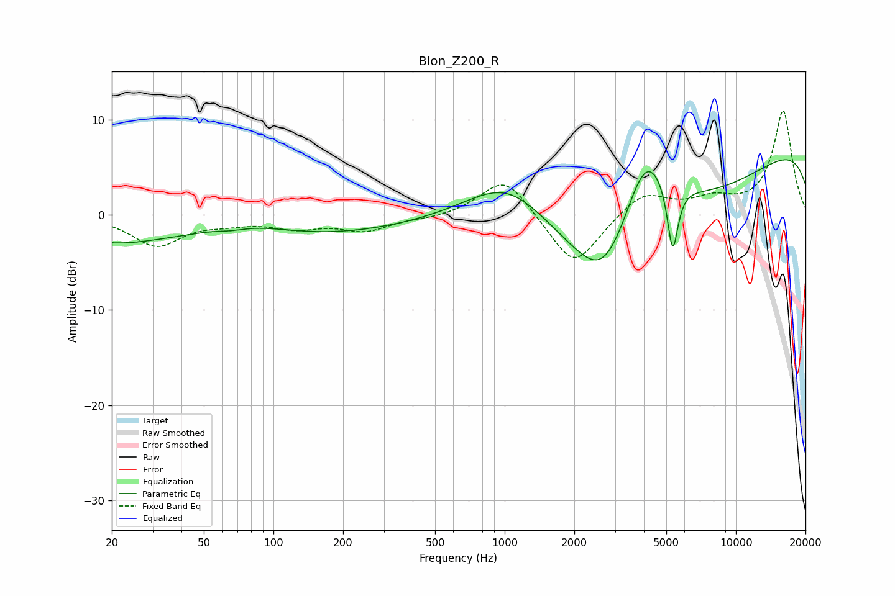

# Blon_Z200_R
See [usage instructions](https://github.com/jaakkopasanen/AutoEq#usage) for more options and info.

### Parametric EQs
Apply preamp of -5.9 dB when using parametric equalizer.

|   # | Type    |   Fc (Hz) |    Q |   Gain (dB) |
|-----|---------|-----------|------|-------------|
|   1 | Peaking |        20 | 0.98 |        -0.7 |
|   2 | Peaking |        58 | 0.18 |        -3.1 |
|   3 | Peaking |        66 | 2.14 |        -0.4 |
|   4 | Peaking |        72 | 0.67 |         1.9 |
|   5 | Peaking |      1036 | 0.68 |         7.1 |
|   6 | Peaking |      2725 | 1.07 |        -7.6 |
|   7 | Peaking |      3984 | 0.22 |       -10.2 |
|   8 | Peaking |      4067 | 1.24 |        10.1 |
|   9 | Peaking |      5328 | 5.85 |        -7.5 |
|  10 | Peaking |     10000 | 0.18 |        10.3 |

### Fixed Band EQs
When using fixed band (also called graphic) equalizer, apply preamp of **-11.1 dB** (if available) and set gains manually with these parameters.

|   # | Type    |   Fc (Hz) |    Q |   Gain (dB) |
|-----|---------|-----------|------|-------------|
|   1 | Peaking |        31 | 1.41 |        -3.1 |
|   2 | Peaking |        62 | 1.41 |        -0.6 |
|   3 | Peaking |       125 | 1.41 |        -1.2 |
|   4 | Peaking |       250 | 1.41 |        -1.5 |
|   5 | Peaking |       500 | 1.41 |        -0.3 |
|   6 | Peaking |      1000 | 1.41 |         4.2 |
|   7 | Peaking |      2000 | 1.41 |        -5.7 |
|   8 | Peaking |      4000 | 1.41 |         2.5 |
|   9 | Peaking |      8000 | 1.41 |         1.4 |
|  10 | Peaking |     16000 | 1.41 |        11   |

### Graphs

