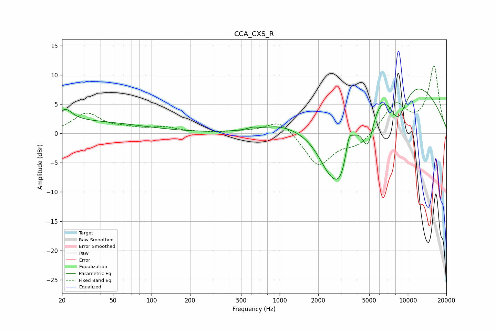

# CCA_CXS_R
See [usage instructions](https://github.com/jaakkopasanen/AutoEq#usage) for more options and info.

### Parametric EQs
Apply preamp of -7.7 dB when using parametric equalizer.

|   # | Type    |   Fc (Hz) |    Q |   Gain (dB) |
|-----|---------|-----------|------|-------------|
|   1 | Peaking |        20 | 0.21 |         2.1 |
|   2 | Peaking |        21 | 2.71 |         2   |
|   3 | Peaking |       617 | 3.29 |         0.4 |
|   4 | Peaking |       979 | 1.24 |         0.7 |
|   5 | Peaking |      2500 | 1.07 |       -10.5 |
|   6 | Peaking |      3031 | 2.03 |        -6.6 |
|   7 | Peaking |      3469 | 5.76 |         3   |
|   8 | Peaking |      4871 | 2.67 |        -8.3 |
|   9 | Peaking |      7031 | 0.32 |        13.8 |
|  10 | Peaking |      8340 | 1.55 |        -8.9 |

### Fixed Band EQs
When using fixed band (also called graphic) equalizer, apply preamp of **-11.6 dB** (if available) and set gains manually with these parameters.

|   # | Type    |   Fc (Hz) |    Q |   Gain (dB) |
|-----|---------|-----------|------|-------------|
|   1 | Peaking |        31 | 1.41 |         3.3 |
|   2 | Peaking |        62 | 1.41 |         0.6 |
|   3 | Peaking |       125 | 1.41 |         0.9 |
|   4 | Peaking |       250 | 1.41 |         0.1 |
|   5 | Peaking |       500 | 1.41 |         0.2 |
|   6 | Peaking |      1000 | 1.41 |         2.5 |
|   7 | Peaking |      2000 | 1.41 |        -5.6 |
|   8 | Peaking |      4000 | 1.41 |        -2   |
|   9 | Peaking |      8000 | 1.41 |         4.9 |
|  10 | Peaking |     16000 | 1.41 |        11.4 |

### Graphs

