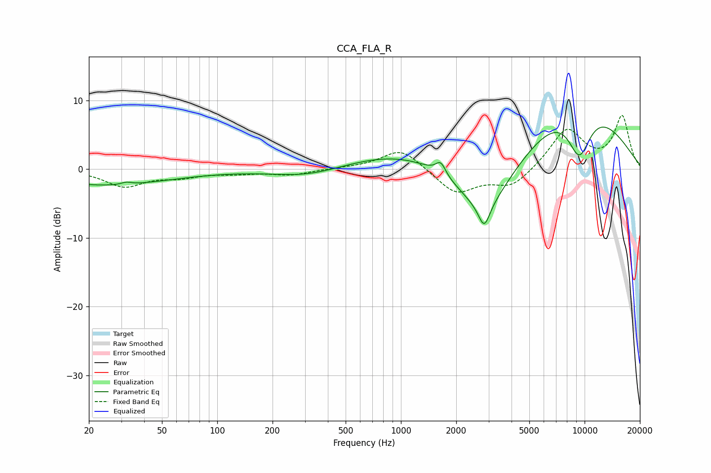

# CCA_FLA_R
See [usage instructions](https://github.com/jaakkopasanen/AutoEq#usage) for more options and info.

### Parametric EQs
Apply preamp of -6.2 dB when using parametric equalizer.

|   # | Type    |   Fc (Hz) |    Q |   Gain (dB) |
|-----|---------|-----------|------|-------------|
|   1 | Peaking |        20 | 0.98 |        -0.2 |
|   2 | Peaking |        26 | 0.42 |        -2.1 |
|   3 | Peaking |        32 | 5.59 |         0.3 |
|   4 | Peaking |       311 | 0.75 |        -1.3 |
|   5 | Peaking |      1070 | 0.48 |         2.8 |
|   6 | Peaking |      1648 | 5.22 |         1.9 |
|   7 | Peaking |      2841 | 4.68 |        -3.4 |
|   8 | Peaking |      2874 | 0.85 |        -9.1 |
|   9 | Peaking |      8978 | 0.49 |        12.3 |
|  10 | Peaking |      9346 | 1.69 |        -9.2 |

### Fixed Band EQs
When using fixed band (also called graphic) equalizer, apply preamp of **-7.9 dB** (if available) and set gains manually with these parameters.

|   # | Type    |   Fc (Hz) |    Q |   Gain (dB) |
|-----|---------|-----------|------|-------------|
|   1 | Peaking |        31 | 1.41 |        -2.4 |
|   2 | Peaking |        62 | 1.41 |        -0.9 |
|   3 | Peaking |       125 | 1.41 |        -0.5 |
|   4 | Peaking |       250 | 1.41 |        -0.8 |
|   5 | Peaking |       500 | 1.41 |         0.1 |
|   6 | Peaking |      1000 | 1.41 |         3.1 |
|   7 | Peaking |      2000 | 1.41 |        -3.6 |
|   8 | Peaking |      4000 | 1.41 |        -2.6 |
|   9 | Peaking |      8000 | 1.41 |         5.8 |
|  10 | Peaking |     16000 | 1.41 |         7.6 |

### Graphs

