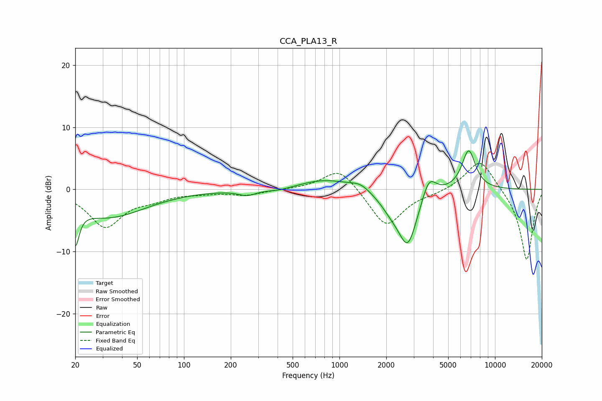

# CCA_PLA13_R
See [usage instructions](https://github.com/jaakkopasanen/AutoEq#usage) for more options and info.

### Parametric EQs
Apply preamp of -6.3 dB when using parametric equalizer.

|   # | Type    |   Fc (Hz) |    Q |   Gain (dB) |
|-----|---------|-----------|------|-------------|
|   1 | Peaking |        20 | 5.91 |        -5.8 |
|   2 | Peaking |        32 | 0.58 |        -4.4 |
|   3 | Peaking |       254 | 2.5  |        -0.9 |
|   4 | Peaking |       409 | 1.65 |        -0.5 |
|   5 | Peaking |       817 | 0.84 |         1.7 |
|   6 | Peaking |      1364 | 2.29 |         1   |
|   7 | Peaking |      2167 | 1.79 |        -2.1 |
|   8 | Peaking |      2757 | 2.25 |        -8.5 |
|   9 | Peaking |      3761 | 3.08 |         3.6 |
|  10 | Peaking |      6776 | 3.04 |         6.4 |

### Fixed Band EQs
When using fixed band (also called graphic) equalizer, apply preamp of **-4.3 dB** (if available) and set gains manually with these parameters.

|   # | Type    |   Fc (Hz) |    Q |   Gain (dB) |
|-----|---------|-----------|------|-------------|
|   1 | Peaking |        31 | 1.41 |        -5.9 |
|   2 | Peaking |        62 | 1.41 |        -1.2 |
|   3 | Peaking |       125 | 1.41 |        -0.4 |
|   4 | Peaking |       250 | 1.41 |        -0.9 |
|   5 | Peaking |       500 | 1.41 |         0   |
|   6 | Peaking |      1000 | 1.41 |         3.7 |
|   7 | Peaking |      2000 | 1.41 |        -6.1 |
|   8 | Peaking |      4000 | 1.41 |        -0.5 |
|   9 | Peaking |      8000 | 1.41 |         5.1 |
|  10 | Peaking |     16000 | 1.41 |       -11.6 |

### Graphs

