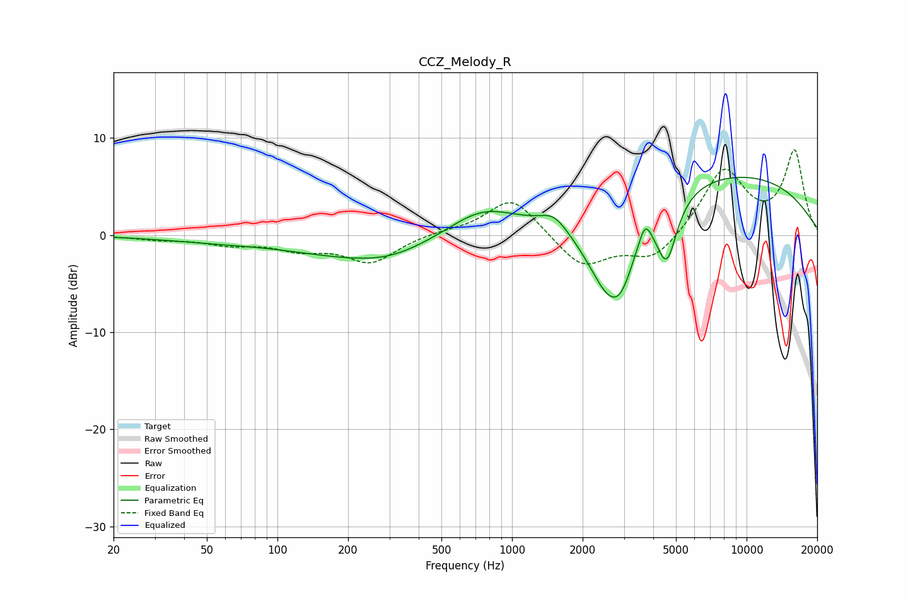

# CCZ_Melody_R
See [usage instructions](https://github.com/jaakkopasanen/AutoEq#usage) for more options and info.

### Parametric EQs
Apply preamp of -6.0 dB when using parametric equalizer.

|   # | Type    |   Fc (Hz) |    Q |   Gain (dB) |
|-----|---------|-----------|------|-------------|
|   1 | Peaking |        52 | 0.6  |        -0.5 |
|   2 | Peaking |       243 | 0.46 |        -2.3 |
|   3 | Peaking |       298 | 1.1  |        -0.5 |
|   4 | Peaking |       739 | 0.94 |         2.8 |
|   5 | Peaking |      1509 | 2.45 |         1.5 |
|   6 | Peaking |      2589 | 1.32 |        -9.3 |
|   7 | Peaking |      2932 | 2.82 |        -2.7 |
|   8 | Peaking |      3691 | 5.27 |         2.2 |
|   9 | Peaking |      4570 | 3.23 |        -6.2 |
|  10 | Peaking |      7138 | 0.24 |         6.7 |

### Fixed Band EQs
When using fixed band (also called graphic) equalizer, apply preamp of **-8.9 dB** (if available) and set gains manually with these parameters.

|   # | Type    |   Fc (Hz) |    Q |   Gain (dB) |
|-----|---------|-----------|------|-------------|
|   1 | Peaking |        31 | 1.41 |        -0.4 |
|   2 | Peaking |        62 | 1.41 |        -0.8 |
|   3 | Peaking |       125 | 1.41 |        -1.3 |
|   4 | Peaking |       250 | 1.41 |        -2.7 |
|   5 | Peaking |       500 | 1.41 |         0.3 |
|   6 | Peaking |      1000 | 1.41 |         4   |
|   7 | Peaking |      2000 | 1.41 |        -3.4 |
|   8 | Peaking |      4000 | 1.41 |        -2.7 |
|   9 | Peaking |      8000 | 1.41 |         6.7 |
|  10 | Peaking |     16000 | 1.41 |         8.5 |

### Graphs

