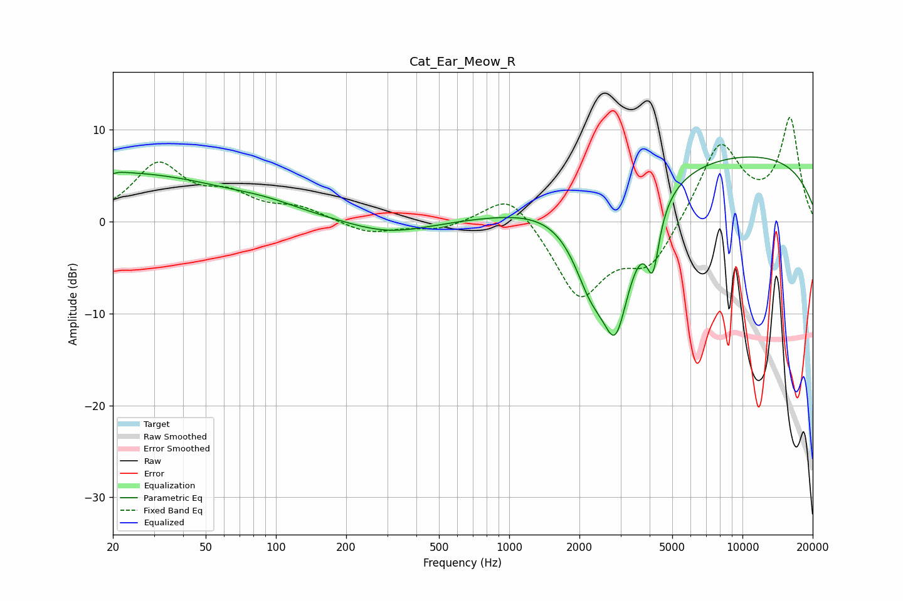

# Cat_Ear_Meow_R
See [usage instructions](https://github.com/jaakkopasanen/AutoEq#usage) for more options and info.

### Parametric EQs
Apply preamp of -7.1 dB when using parametric equalizer.

|   # | Type    |   Fc (Hz) |    Q |   Gain (dB) |
|-----|---------|-----------|------|-------------|
|   1 | Peaking |        20 | 5.92 |        -2.7 |
|   2 | Peaking |        20 | 0.26 |         5.3 |
|   3 | Peaking |        20 | 5.65 |         2.6 |
|   4 | Peaking |        79 | 1.77 |         0.1 |
|   5 | Peaking |        98 | 1.16 |         0.4 |
|   6 | Peaking |       304 | 0.81 |        -1.5 |
|   7 | Peaking |      2228 | 1.87 |        -5.8 |
|   8 | Peaking |      2861 | 1.84 |       -14.6 |
|   9 | Peaking |      4129 | 5.18 |        -6.3 |
|  10 | Peaking |      8275 | 0.18 |         7.6 |

### Fixed Band EQs
When using fixed band (also called graphic) equalizer, apply preamp of **-11.4 dB** (if available) and set gains manually with these parameters.

|   # | Type    |   Fc (Hz) |    Q |   Gain (dB) |
|-----|---------|-----------|------|-------------|
|   1 | Peaking |        31 | 1.41 |         6   |
|   2 | Peaking |        62 | 1.41 |         2.4 |
|   3 | Peaking |       125 | 1.41 |         1.3 |
|   4 | Peaking |       250 | 1.41 |        -1.3 |
|   5 | Peaking |       500 | 1.41 |        -0.9 |
|   6 | Peaking |      1000 | 1.41 |         3.7 |
|   7 | Peaking |      2000 | 1.41 |        -8.2 |
|   8 | Peaking |      4000 | 1.41 |        -4.8 |
|   9 | Peaking |      8000 | 1.41 |         8.6 |
|  10 | Peaking |     16000 | 1.41 |        11   |

### Graphs

