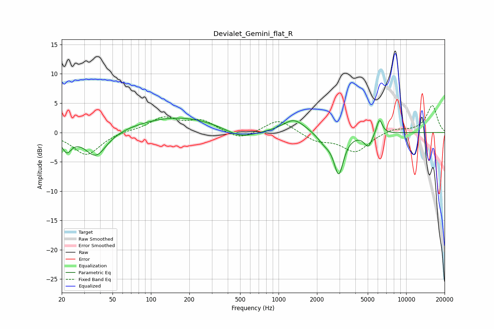

# Devialet_Gemini_flat_R
See [usage instructions](https://github.com/jaakkopasanen/AutoEq#usage) for more options and info.

### Parametric EQs
Apply preamp of -2.5 dB when using parametric equalizer.

|   # | Type    |   Fc (Hz) |    Q |   Gain (dB) |
|-----|---------|-----------|------|-------------|
|   1 | Peaking |        22 | 3.68 |        -2.7 |
|   2 | Peaking |        37 | 1.68 |        -4.3 |
|   3 | Peaking |       163 | 0.44 |         2.7 |
|   4 | Peaking |       503 | 1.18 |        -1.6 |
|   5 | Peaking |      1305 | 1.71 |         2   |
|   6 | Peaking |      1470 | 1.56 |         0.3 |
|   7 | Peaking |      2290 | 2.57 |        -1.4 |
|   8 | Peaking |      2961 | 3.71 |        -6.8 |
|   9 | Peaking |      5039 | 4.41 |        -2.3 |
|  10 | Peaking |      6172 | 6    |         2.7 |

### Fixed Band EQs
When using fixed band (also called graphic) equalizer, apply preamp of **-4.7 dB** (if available) and set gains manually with these parameters.

|   # | Type    |   Fc (Hz) |    Q |   Gain (dB) |
|-----|---------|-----------|------|-------------|
|   1 | Peaking |        31 | 1.41 |        -3.9 |
|   2 | Peaking |        62 | 1.41 |         0.3 |
|   3 | Peaking |       125 | 1.41 |         2.4 |
|   4 | Peaking |       250 | 1.41 |         1.9 |
|   5 | Peaking |       500 | 1.41 |        -1.4 |
|   6 | Peaking |      1000 | 1.41 |         2.3 |
|   7 | Peaking |      2000 | 1.41 |        -1.4 |
|   8 | Peaking |      4000 | 1.41 |        -3.3 |
|   9 | Peaking |      8000 | 1.41 |         0.7 |
|  10 | Peaking |     16000 | 1.41 |         4.6 |

### Graphs

