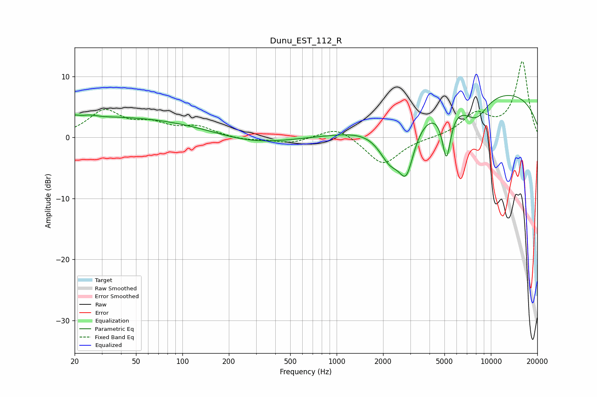

# Dunu_EST_112_R
See [usage instructions](https://github.com/jaakkopasanen/AutoEq#usage) for more options and info.

### Parametric EQs
Apply preamp of -7.0 dB when using parametric equalizer.

|   # | Type    |   Fc (Hz) |    Q |   Gain (dB) |
|-----|---------|-----------|------|-------------|
|   1 | Peaking |        20 | 5.79 |         0.3 |
|   2 | Peaking |        25 | 2.6  |         1   |
|   3 | Peaking |        26 | 2.19 |        -0.7 |
|   4 | Peaking |        30 | 0.2  |         3.4 |
|   5 | Peaking |       284 | 0.6  |        -1.3 |
|   6 | Peaking |      2220 | 1.84 |        -5.6 |
|   7 | Peaking |      2833 | 2.78 |        -7.6 |
|   8 | Peaking |      5153 | 4.98 |        -8.1 |
|   9 | Peaking |      8011 | 1.65 |        -3.9 |
|  10 | Peaking |      9585 | 0.21 |         7.9 |

### Fixed Band EQs
When using fixed band (also called graphic) equalizer, apply preamp of **-12.6 dB** (if available) and set gains manually with these parameters.

|   # | Type    |   Fc (Hz) |    Q |   Gain (dB) |
|-----|---------|-----------|------|-------------|
|   1 | Peaking |        31 | 1.41 |         4.2 |
|   2 | Peaking |        62 | 1.41 |         1.9 |
|   3 | Peaking |       125 | 1.41 |         1.6 |
|   4 | Peaking |       250 | 1.41 |        -0.5 |
|   5 | Peaking |       500 | 1.41 |        -0.9 |
|   6 | Peaking |      1000 | 1.41 |         1.9 |
|   7 | Peaking |      2000 | 1.41 |        -4.6 |
|   8 | Peaking |      4000 | 1.41 |        -0.1 |
|   9 | Peaking |      8000 | 1.41 |         3.6 |
|  10 | Peaking |     16000 | 1.41 |        12.4 |

### Graphs

