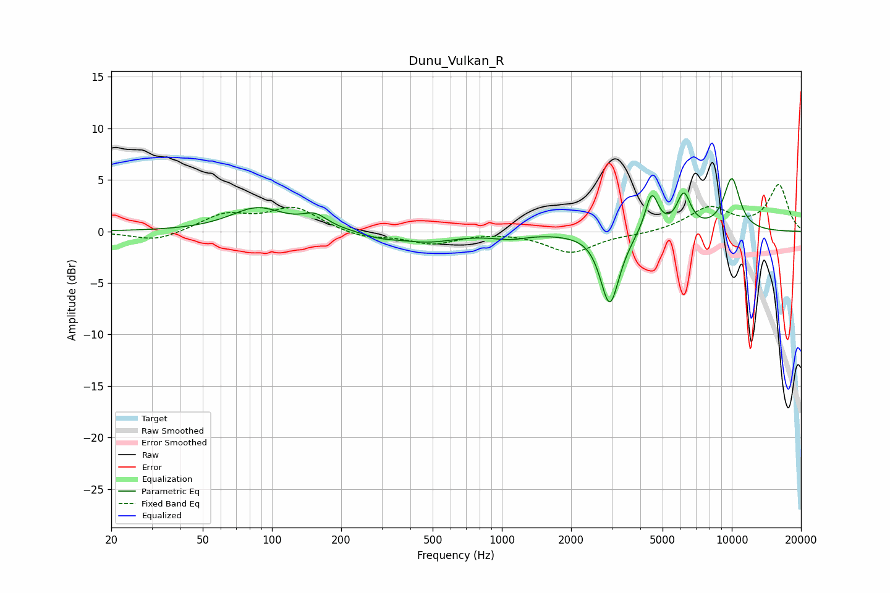

# Dunu_Vulkan_R
See [usage instructions](https://github.com/jaakkopasanen/AutoEq#usage) for more options and info.

### Parametric EQs
Apply preamp of -5.2 dB when using parametric equalizer.

|   # | Type    |   Fc (Hz) |    Q |   Gain (dB) |
|-----|---------|-----------|------|-------------|
|   1 | Peaking |        86 | 1.21 |         2.2 |
|   2 | Peaking |       154 | 2.56 |         1.2 |
|   3 | Peaking |       294 | 1.84 |        -0.4 |
|   4 | Peaking |       471 | 1.09 |        -1   |
|   5 | Peaking |      1085 | 1.92 |        -0.5 |
|   6 | Peaking |      2493 | 2.62 |         0.3 |
|   7 | Peaking |      2945 | 3.34 |        -7.3 |
|   8 | Peaking |      4484 | 4.82 |         3.8 |
|   9 | Peaking |      6181 | 4.5  |         3.4 |
|  10 | Peaking |     10000 | 3.37 |         5.1 |

### Fixed Band EQs
When using fixed band (also called graphic) equalizer, apply preamp of **-4.6 dB** (if available) and set gains manually with these parameters.

|   # | Type    |   Fc (Hz) |    Q |   Gain (dB) |
|-----|---------|-----------|------|-------------|
|   1 | Peaking |        31 | 1.41 |        -1   |
|   2 | Peaking |        62 | 1.41 |         1.6 |
|   3 | Peaking |       125 | 1.41 |         2.2 |
|   4 | Peaking |       250 | 1.41 |        -0.6 |
|   5 | Peaking |       500 | 1.41 |        -1.1 |
|   6 | Peaking |      1000 | 1.41 |         0.1 |
|   7 | Peaking |      2000 | 1.41 |        -2   |
|   8 | Peaking |      4000 | 1.41 |        -0.2 |
|   9 | Peaking |      8000 | 1.41 |         2.3 |
|  10 | Peaking |     16000 | 1.41 |         4.5 |

### Graphs

