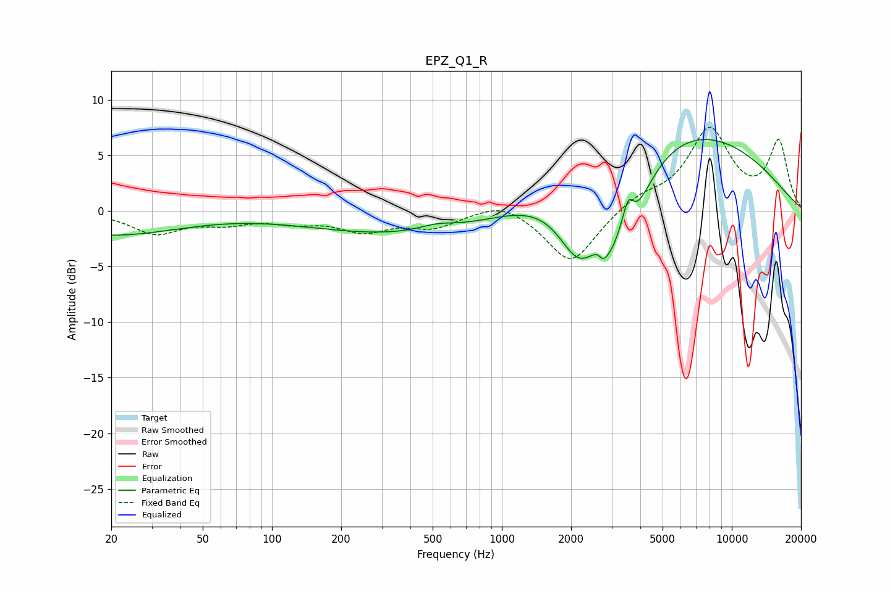

# EPZ_Q1_R
See [usage instructions](https://github.com/jaakkopasanen/AutoEq#usage) for more options and info.

### Parametric EQs
Apply preamp of -6.5 dB when using parametric equalizer.

|   # | Type    |   Fc (Hz) |    Q |   Gain (dB) |
|-----|---------|-----------|------|-------------|
|   1 | Peaking |        20 | 0.47 |        -2.1 |
|   2 | Peaking |       520 | 1.77 |         0.6 |
|   3 | Peaking |       542 | 0.26 |        -2.5 |
|   4 | Peaking |      2151 | 1.5  |        -6.1 |
|   5 | Peaking |      2647 | 5.99 |         1   |
|   6 | Peaking |      2732 | 5.67 |        -1.6 |
|   7 | Peaking |      3264 | 4.53 |         1.5 |
|   8 | Peaking |      3328 | 1.53 |        -9.6 |
|   9 | Peaking |      3541 | 5.42 |         3.6 |
|  10 | Peaking |      4941 | 0.28 |         8.4 |

### Fixed Band EQs
When using fixed band (also called graphic) equalizer, apply preamp of **-7.6 dB** (if available) and set gains manually with these parameters.

|   # | Type    |   Fc (Hz) |    Q |   Gain (dB) |
|-----|---------|-----------|------|-------------|
|   1 | Peaking |        31 | 1.41 |        -1.9 |
|   2 | Peaking |        62 | 1.41 |        -0.9 |
|   3 | Peaking |       125 | 1.41 |        -0.8 |
|   4 | Peaking |       250 | 1.41 |        -1.6 |
|   5 | Peaking |       500 | 1.41 |        -1.3 |
|   6 | Peaking |      1000 | 1.41 |         1.1 |
|   7 | Peaking |      2000 | 1.41 |        -4.8 |
|   8 | Peaking |      4000 | 1.41 |         1.2 |
|   9 | Peaking |      8000 | 1.41 |         7.2 |
|  10 | Peaking |     16000 | 1.41 |         6.1 |

### Graphs

