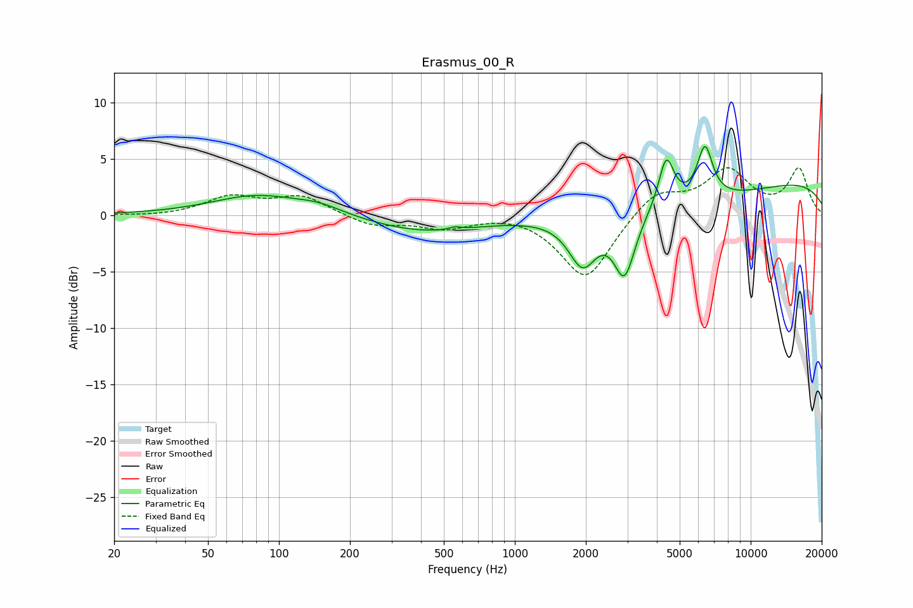

# Erasmus_00_R
See [usage instructions](https://github.com/jaakkopasanen/AutoEq#usage) for more options and info.

### Parametric EQs
Apply preamp of -6.2 dB when using parametric equalizer.

|   # | Type    |   Fc (Hz) |    Q |   Gain (dB) |
|-----|---------|-----------|------|-------------|
|   1 | Peaking |        81 | 0.74 |         1.7 |
|   2 | Peaking |       149 | 1.43 |         0.7 |
|   3 | Peaking |       410 | 0.61 |        -1.4 |
|   4 | Peaking |       557 | 5.97 |         0.2 |
|   5 | Peaking |      1937 | 2.39 |        -4.2 |
|   6 | Peaking |      2918 | 3.18 |        -5.4 |
|   7 | Peaking |      4384 | 4.31 |         4.4 |
|   8 | Peaking |      4684 | 0.31 |        -2.3 |
|   9 | Peaking |      6398 | 4.18 |         4.6 |
|  10 | Peaking |      9228 | 0.18 |         3.7 |

### Fixed Band EQs
When using fixed band (also called graphic) equalizer, apply preamp of **-4.3 dB** (if available) and set gains manually with these parameters.

|   # | Type    |   Fc (Hz) |    Q |   Gain (dB) |
|-----|---------|-----------|------|-------------|
|   1 | Peaking |        31 | 1.41 |        -0.1 |
|   2 | Peaking |        62 | 1.41 |         1.6 |
|   3 | Peaking |       125 | 1.41 |         1.6 |
|   4 | Peaking |       250 | 1.41 |        -1   |
|   5 | Peaking |       500 | 1.41 |        -1.1 |
|   6 | Peaking |      1000 | 1.41 |         0.3 |
|   7 | Peaking |      2000 | 1.41 |        -5.8 |
|   8 | Peaking |      4000 | 1.41 |         2.2 |
|   9 | Peaking |      8000 | 1.41 |         3.8 |
|  10 | Peaking |     16000 | 1.41 |         4   |

### Graphs

