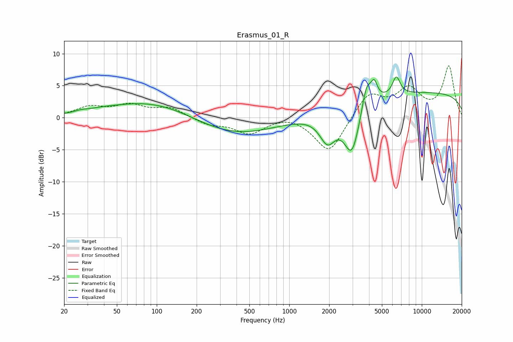

# Erasmus_01_R
See [usage instructions](https://github.com/jaakkopasanen/AutoEq#usage) for more options and info.

### Parametric EQs
Apply preamp of -6.4 dB when using parametric equalizer.

|   # | Type    |   Fc (Hz) |    Q |   Gain (dB) |
|-----|---------|-----------|------|-------------|
|   1 | Peaking |        27 | 3.07 |         0.2 |
|   2 | Peaking |        37 | 1.45 |         0.2 |
|   3 | Peaking |        94 | 0.42 |         2.8 |
|   4 | Peaking |       369 | 0.45 |        -2.9 |
|   5 | Peaking |      1944 | 2.34 |        -4.3 |
|   6 | Peaking |      2972 | 2.34 |        -7.5 |
|   7 | Peaking |      3823 | 3.97 |         4.1 |
|   8 | Peaking |      4372 | 5.69 |         2.6 |
|   9 | Peaking |      6422 | 4.69 |         2.8 |
|  10 | Peaking |     10000 | 0.18 |         3.9 |

### Fixed Band EQs
When using fixed band (also called graphic) equalizer, apply preamp of **-8.2 dB** (if available) and set gains manually with these parameters.

|   # | Type    |   Fc (Hz) |    Q |   Gain (dB) |
|-----|---------|-----------|------|-------------|
|   1 | Peaking |        31 | 1.41 |         1.5 |
|   2 | Peaking |        62 | 1.41 |         1.8 |
|   3 | Peaking |       125 | 1.41 |         1.5 |
|   4 | Peaking |       250 | 1.41 |        -1   |
|   5 | Peaking |       500 | 1.41 |        -2.4 |
|   6 | Peaking |      1000 | 1.41 |         0.6 |
|   7 | Peaking |      2000 | 1.41 |        -5.6 |
|   8 | Peaking |      4000 | 1.41 |         3.9 |
|   9 | Peaking |      8000 | 1.41 |         4.2 |
|  10 | Peaking |     16000 | 1.41 |         7.9 |

### Graphs

