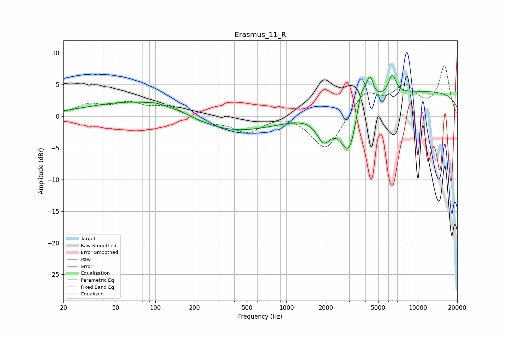

# Erasmus_11_R
See [usage instructions](https://github.com/jaakkopasanen/AutoEq#usage) for more options and info.

### Parametric EQs
Apply preamp of -6.6 dB when using parametric equalizer.

|   # | Type    |   Fc (Hz) |    Q |   Gain (dB) |
|-----|---------|-----------|------|-------------|
|   1 | Peaking |        80 | 0.37 |         2.7 |
|   2 | Peaking |       100 | 2.7  |         0.3 |
|   3 | Peaking |       148 | 0.99 |         0.5 |
|   4 | Peaking |       349 | 0.39 |        -2.9 |
|   5 | Peaking |      1923 | 2.6  |        -3.8 |
|   6 | Peaking |      3018 | 2.02 |        -8.4 |
|   7 | Peaking |      3718 | 3.39 |         4.7 |
|   8 | Peaking |      4333 | 5.58 |         3.4 |
|   9 | Peaking |      6403 | 4.87 |         3.1 |
|  10 | Peaking |     10000 | 0.18 |         4   |

### Fixed Band EQs
When using fixed band (also called graphic) equalizer, apply preamp of **-8.0 dB** (if available) and set gains manually with these parameters.

|   # | Type    |   Fc (Hz) |    Q |   Gain (dB) |
|-----|---------|-----------|------|-------------|
|   1 | Peaking |        31 | 1.41 |         1.7 |
|   2 | Peaking |        62 | 1.41 |         1.8 |
|   3 | Peaking |       125 | 1.41 |         1.6 |
|   4 | Peaking |       250 | 1.41 |        -1   |
|   5 | Peaking |       500 | 1.41 |        -2.4 |
|   6 | Peaking |      1000 | 1.41 |         0.6 |
|   7 | Peaking |      2000 | 1.41 |        -5.7 |
|   8 | Peaking |      4000 | 1.41 |         3.9 |
|   9 | Peaking |      8000 | 1.41 |         4.2 |
|  10 | Peaking |     16000 | 1.41 |         7.8 |

### Graphs

