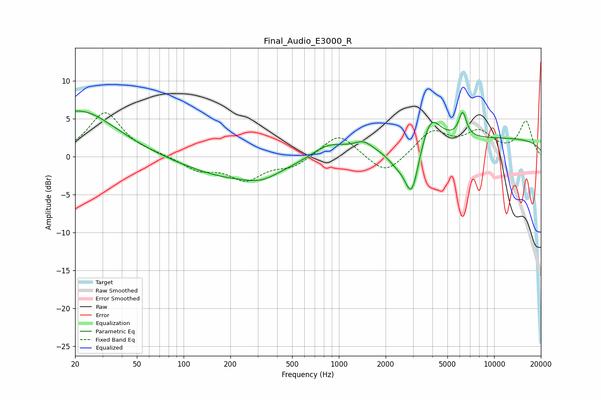

# Final_Audio_E3000_R
See [usage instructions](https://github.com/jaakkopasanen/AutoEq#usage) for more options and info.

### Parametric EQs
Apply preamp of -6.1 dB when using parametric equalizer.

|   # | Type    |   Fc (Hz) |    Q |   Gain (dB) |
|-----|---------|-----------|------|-------------|
|   1 | Peaking |        21 | 0.59 |         6.1 |
|   2 | Peaking |       220 | 0.44 |        -2.9 |
|   3 | Peaking |       317 | 1.48 |        -0.8 |
|   4 | Peaking |       857 | 1.2  |         1.9 |
|   5 | Peaking |      1437 | 2.33 |         1.2 |
|   6 | Peaking |      2363 | 2.17 |        -1.6 |
|   7 | Peaking |      2945 | 3.05 |        -6.6 |
|   8 | Peaking |      3897 | 2.3  |         4   |
|   9 | Peaking |      6265 | 5.57 |         3.2 |
|  10 | Peaking |     10000 | 0.18 |         2.4 |

### Fixed Band EQs
When using fixed band (also called graphic) equalizer, apply preamp of **-5.9 dB** (if available) and set gains manually with these parameters.

|   # | Type    |   Fc (Hz) |    Q |   Gain (dB) |
|-----|---------|-----------|------|-------------|
|   1 | Peaking |        31 | 1.41 |         5.8 |
|   2 | Peaking |        62 | 1.41 |         0.2 |
|   3 | Peaking |       125 | 1.41 |        -1.7 |
|   4 | Peaking |       250 | 1.41 |        -2.9 |
|   5 | Peaking |       500 | 1.41 |        -1.3 |
|   6 | Peaking |      1000 | 1.41 |         3.2 |
|   7 | Peaking |      2000 | 1.41 |        -2.6 |
|   8 | Peaking |      4000 | 1.41 |         3.3 |
|   9 | Peaking |      8000 | 1.41 |         2.9 |
|  10 | Peaking |     16000 | 1.41 |         4.6 |

### Graphs

